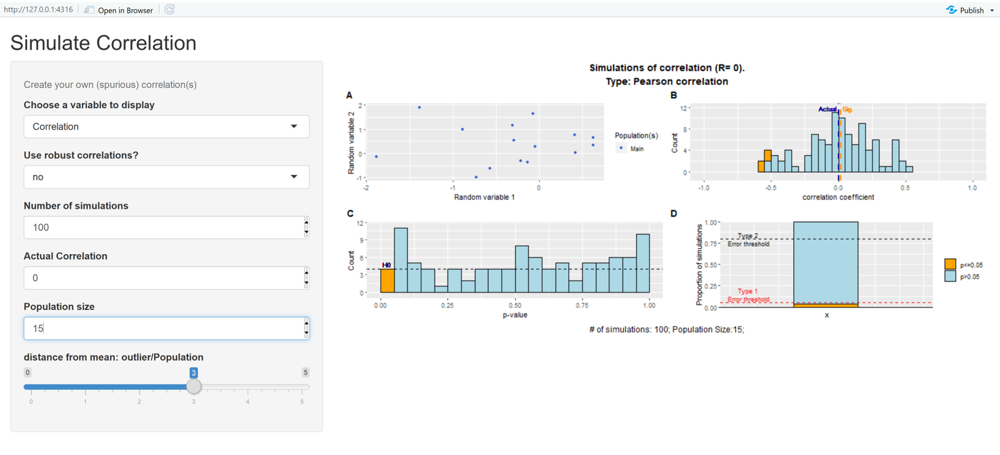

```{r setup, include=FALSE}
# options for producing the document
knitr::opts_chunk$set(echo = TRUE, eval.after = "fig.cap")
# different R packages that are used in this document and the function use from each of them
library(Hmisc) # for rcorr
library(MASS) # for mvnorm
library(ggplot2)
library(WRS2) # for wincor and pbcor
library(captioner) # for captioner
library(knitr) # kable function to make tables
library(ggpubr) # for ggarrange
fig_nums <- captioner()
```

# To do 

16. ggarragne in outliers and subgroup for p-val distribution and %
17. text subgroups

# Introduction

Statistical significance and the concept of p-values are at the heart of a philosophical debate [@wasserstein2016]. Should we abandon the use of p-values [@szucs2017], should we use a more severe significance threshold [@benjamin2018], an adapted one [@lakens2018] or remove it entirely [@amrhein2018a]? These questions are often hotly debated in scientific papers or on social media. Yet, the problem with p-values is that people do not understand them properly or do not understand the circumstances under which a p-value can be used [@colquhoun2014; @gagnier2017a; @greenland2016]. A p-value can be defined as follows: "*the P value can be viewed as a continuous measure of the compatibility between the data and the entire model used to compute it, ranging from 0 for complete incompatibility to 1 for perfect compatibility*" [@greenland2016] or "*p-value is the probability that the data would be equal to or more extreme than what would be expected by chance.*". Yet, such definition does not provide a lot of insights for most people on how p-values behave in different circumstances. Here, we use our ability to generate random samples of different populations as a tool to get insights into p-values [@colquhoun2014; @martins2018; @ohara2019; @tintle2015]. These simulations of randomly correlated or uncorrelated variables are done with correlations as the statistical test of interest. These simulations highlight and many problems that have been discussed in meta-science (the science of science). This part adresses the significance problem linked to p-values.


But p-values on their own have very little value if they are not coupled to the effect size of an effect [@hubbard2008]. Indeed, while we sommetimes want to know whether a relationship exist between two variables (e.g. air pollution and respiratory disease), we often also want to know the importance of this link. Does hair pollution explains 0.1 or 25% of respiratory disease incidence. The ability to estimate the importance of such relationship is referred to as the estimation problem. Estimation is important not for distinguishing between two theories but to assess the magnitude of the relationship [@sullivan2012]. The estimation problem is made complicated by publication bias [@joober2012; @mlinaric2017; @song2013]. That is, people do not cherish not significant effect and rarely published them while significant effects are published very easily. We will thus use simulation to understand how publication bias is a threat for the estimation of the magnitude of the effect size.

This publication bias is also linked to the presentation of results that are too good to be true [@francis2013a]. Simulation of artificial data can also provide us with information about the type of results that should be expected [@lakens2017a]. That is, if two variables are correlated and we run three times the same experiment, how many significant p-values do you expect? Note that tackling this question will tell what the expected patterns of p-values are in the presence of an effect. 

The simulations and corresponding p-values reported in this paper were based on the correlation between two variables. Correlation was chosen as an example of statistical test because it is very frequently used in scientific papers. The correlation coefficient represents the strength of the association between two variables [@leerodgers1988; @taylor1990]. While the correlation coefficient has been deemed to be robust against violations of the assumptions [@havlicek1976], we now know that it is at least extremely sensitive to outliers [@abdullah1990; @pernet2013; @zimmerman1994; @rousselet2012a]. That is, as we will see below, a slight irregularity in the data is sufficient to obtain significant but spurious correlations.

Therefore, the goal of this paper is to show that simulation of artificial data can be a valid tool to understand the behavior of p-values [@ohara2019; @tintle2015], to get insights into the estimation problem [@pernet2013] and to find the best technique to account for irregularities in the data [@rousselet2012a]. This paper is partially inspirated by the blogposts of Prof. Dorothy Bishop: [Blog 1](http://deevybee.blogspot.com/2017/11/how-analysis-of-variance-works.html), [Blog 2](https://deevybee.blogspot.com/2017/11/anova-t-tests-and-regression-different.html), [Blog3](https://deevybee.blogspot.com/2017/12/using-simulations-to-understand.html), [Blog 4](http://deevybee.blogspot.com/2017/12/using-simulations-to-understand-p-values.html), [Presentation](https://www.slideshare.net/deevybishop/introduction-to-simulating-data-to-improve-your-research)

# Learning about statistics from simulated correlations.

```{r ParamDef, echo=FALSE}
# defining default parameters
PopSize=15 # size of the population/sample
Nsim=100 # number of simulated populations/samples. 100 to go fast / should be 10000
Rval=0 # for simulating when there is no correlations between the measured parameters
Rval50=0.5 # for generating correlated measured parameters within a population
BinSize <- 0.01 # for histograms of p-values
```

Let's imagine the following experiment. Researchers from Klow in Syldavia are willing to measure height and working memory capacity in a population of young healthy participants. Because of their limited budget, they are able to measure these parameters in a population of `r PopSize`  participants. For each individual participant $i$, they have two observations: $(x_i,y_i)$ where $x_i$ is the height of the participant and $y_i$ is his/her working memory capacity. Then, the researchers decided to test the correlation between these two variables for their population.
There is no reason whatsoever to expect a correlation between height and working memory capacity. This should be zero. 
We can simulate this experiment numerically by generating `r PopSize` random numbers with mean of 0 and standard deviation of 1 corresponding to the simulated height of each participant and `r PopSize` different random numbers with mean of 0 and standard deviation of 1 corresponding to the simulated working memory capacity of each participant. A mean of 0 and a standard deviation of 1 were chosen for simplicity but all the arguments below hold if ones picks another mean and/or another standard deviation. By doing this, we have generated `r PopSize` pairs of height and working memory capacity (the measured parameters). To follow the idea of our Syldavian researchers, we can then compute the correlation between height and working memory capacity of our randomly generated parameters across the population of `r PopSize` individuals.

## simulating a single correlation between two randomly generated samples

In summary, to generate two independent variables (with zero correlations), we will apply the following algorithm:
1. Pick randomly a number from a Gaussian distribution (mean = 0 and standard deviation =1) and assign this number to the height of this participant ($x_i$)
2. Pick randomly a number from a Gaussian distribution (mean = 0 and standard deviation =1) and assign this number to the working memory capacity of this participant ($y_i$)
3. Repeat for every individual $i$ in the population (N= `r PopSize`)
```{r CorrelR0, echo=FALSE}
library(Hmisc) # for rcorr
library(MASS) # for mvnorm
set.seed(12)# to make sure everybody gets the same results
x=mvrnorm(PopSize,0,1,empirical = FALSE)
y=mvrnorm(PopSize,0,1,empirical = FALSE)
XY = data.frame(Xi = x,yi = y)
colnames(XY)<- c("height (xi)","working memory capacity (yi)")
rownames(XY)<- c("Subj # 1","Subj # 2","Subj # 3","Subj # 4","Subj # 5","Subj # 6","Subj # 7","Subj # 8","Subj # 9","Subj # 10","Subj # 11","Subj # 12","Subj # 13","Subj # 14","Subj # 15")
R<-rcorr(x,y)
Rres <- cor.test(x, y, method = "pearson")
Scatter1 <- data.frame(x,y)
PP4 <- ggplot(Scatter1, aes(x=x, y=y)) +
  geom_point()+
  geom_smooth(method='lm',se=FALSE)+
  labs(title = "",x="height", y="working memory capacity")
fig_nums("PP4", "Absence of correlation from two randomly generated samples from two uncorrelated variables",display=FALSE)

```
 By doing so, we obtain the following matrices:
```{r DisplayMatrixR0, echo = FALSE, results = 'asis'}
kable(XY, caption = "randomly generated parameters for the individuals of the population")
```

These values are unitless. Some of them are positive other negative values.Now that we have generated data for height and working memory capacity for each individual, we can test the correlation between these two parameters. We wil first use the Pearson's correlation, which is used in most scientific studies.
Off course, one should not expect any correlation between height and working memory capacity as these are sampled from random independent distributions. The two randomly generated parameters have a correlation coefficient R= `r format(R$r[1,2], digits = 2)` (CI: [`r format(Rres$conf.int[1], digits = 2)`, `r format(Rres$conf.int[2], digits = 2)`], p-value = `r format(R$P[1,2], digits = 2)`). Interstingly, while the two variables should be independent (height and working memory were generated randomly and independently), their correlation coefficient is not exactly zero. Yet, the value of the correlation coefficient is low (weak effect size) and the associated p-value informs us that observing such a correlation coefficient is not so unlikely under the hypothesis that there is no correlation (the null hypothesis). In other words, we cannot conclude from this data that the variables height and working memory capacity are related in this population (and we cannot conclude that these are not correlated either).
````{r plotR0, echo=FALSE, fig.cap= fig_nums("PP4")} 
PP4
```

Now, this is the data from a single city. Let's now simulate what would happen if the same correlation was computed for `r Nsim` different towns with enough inhabitants. In this case, we should repeat the process `r Nsim` times in order to know whether the result obtained for `r fig_nums("PP4", display = "cite")` is a special case or not. That is, for every simulated city (N=`r Nsim`), we will generate random numbers for the two parameters (height and working memory capacity). We will then obtain the size (correlation coefficient) and significance (p-value) of the correlation between these parameters for every one of the `r Nsim` towns.

## simulating multiple correlation between two randomly generated parameters

Being able to perform these simulations in any programming language has certainly a large added value as we will show below. Therefore, we encourage the interested reader to use the code below to perform these simulations in R. For the readers who do not have the time or the willingness to do so, they can use the web application developed for this paper (See ShinyApp section below).

### doing that in R

Simmulating randomly generated parameters for a given number of participants can be done in $R$ with the $mvrnorm$ function from the $MASS$ package. To draw `r PopSize` samples from a normal distribution, we can do
``` {r eval=FALSE}
library(Hmisc) # for rcorr
library(MASS) # for mvnorm
set.seed(12)# to make sure everybody gets the same results
# number of individuals in the population/sample
PopSize = 15
# 15 randomly generated number representing the height of the 15 individuals in the population
x=mvrnorm(PopSize,0,1,empirical = FALSE)
# 15 randomly generated number representing the working memory capacity of the 15 individuals in the population
y=mvrnorm(PopSize,0,1,empirical = FALSE)
# correlation between the x and y variables
R<-rcorr(x,y)
# display correlation coefficient
R$r[1,2]
# display corresponding p-values
R$P[1,2]
```
We will then repeat this process `r Nsim` times to obtain a reliable distribution of the p-values. To do so, we will use the ability of the mvnorm function to simultaneously generate random values for the x and y uncorrelated variables. This can be done on the basis of the covariance matrix Sigma:
$$
Sigma = \begin{pmatrix}
1 & 0\\
0 & 1
\end{pmatrix}
$$
where the off-diagonal element of the covariance matrix indicate the theoretical value of the correlation between the variables x and y (Here, R=`r Rval`). Using this covariance matrix, we will use the $mvnorm$ function to build two uncorrelated variables at the same time. This is repeated `r Nsim`  times (Nsim= `r Nsim`) in the code below:

``` {r eval=FALSE}
library(Hmisc) # for rcorr
library(MASS) # for mvnorm
set.seed(123)# to make sure everybody gets the same results
Nsim=10000 # number of simulations
PopSize = 15 #number os elements in each sample
Sigma <- matrix(c(1,0,0,1),2,2)# covariance matrix
res <- data.frame(p=rep(NA,Nsim),R=rep(NA,Nsim),Sig=rep(NA,Nsim)) # pre-allocating space for the dataframe
for (i in c(1:Nsim)){
  # drawing 15 elements for each random variable (x and y) with a covariance matrix equal to Sigma
  # the first column of D corresponds to the samples of the x parameter (e.g. the height) and the second to the samples of the y parameter (e.g. working memory capacity)
  D <- mvrnorm(n = PopSize, rep(0, 2), Sigma, empirical = FALSE) 
  R<-rcorr(D[,1],D[,2]) # correlation between the randomly generated x and y 
  res[i,"R"] <- R$r[1,2] # storing the correlation value for future use
  res[i,"p"]<-R$P[1,2]# storing the p-value for future use
  res[i,"Sig"]<-res[i,"p"]<0.05 # tag p-values smaller than the type II error threshold (here 0.05)
}
```

In the code above the R-dataframe $res$ stores the results of the correlation between x (first colunm of D - $D[,1]$) and y (second column of D = $D[,2]$) for each iteration of the simulations. The value of the correlation coefficient ($R \$ r[1,2]$) and the associated p-value ($R \$ p[1,2]$) are stored in this dataframe. One can use this dataframe to generate the histogram illustrating the distribution of p-values (see `r fig_nums("PP2", display = "cite")` below).

``` {r eval=FALSE}
library(ggplot2) 
# plotting the distribution of p-values
Fcolor <- c("lightblue","orange")
ggplot(res, aes(x=p, fill=Sig)) + 
  geom_histogram(aes(x=p,fill=Sig),binwidth=BinSize,boundary = 0.05,color="black")+
  scale_fill_manual(values = Fcolor)
```

### using the ShinyApp

For the readers that are not (yet) familiar with the R language, one can simply follow the following steps to be able to interactively follow this tutorial:

1. download and install R and Rstudio (both needed) (e.g. https://courses.edx.org/courses/UTAustinX/UT.7.01x/3T2014/56c5437b88fa43cf828bff5371c6a924/)

2. install the shiny package (run the following from Rstudio console: `install.packages("shiny")`)
3. call the Shiny library (run the following from Rstudio console: `library(shiny)`)
4. run the following from an R console: runGitHub("SpuriousCorrelation","jjodx")

and you can reproduce all the manipulations explained below thanks to the program that is now open 

## What is the expected p-value distribution if there are no correlations

``` {r SimulationR0, echo=FALSE}
set.seed(123)# to make sure everybody gets the same results
Rval = 0 # value of the simulated correlation
res <- data.frame(p=rep(NA,Nsim),R=rep(NA,Nsim),Sig=rep(NA,Nsim))
Sigma <- matrix(c(1,Rval,Rval,1),2,2)
for (i in c(1:Nsim)){
      D <- mvrnorm(n = PopSize, rep(0, 2), Sigma, empirical = FALSE)
      R<-rcorr(D[,1],D[,2])
      res[i,"R"] <- R$r[1,2]
      res[i,"p"]<-R$P[1,2]
      res[i,"Sig"]<-res[i,"p"]<0.05
      res[i,"SigBin"]<-res[i,"p"]<BinSize
}

Fcolor <- c("orange","lightblue")
CountSig <- sum(res$Sig)
Psig <- CountSig/length(res$Sig)
res$Sig = factor(1-res$Sig)
PP2 <- ggplot(res, aes(x=p, fill=Sig)) + 
    geom_histogram(aes(x=p,fill=Sig),binwidth=BinSize,boundary = 0.05,color="black") +
    scale_fill_manual(values = Fcolor) +
    geom_hline(yintercept=sum(res$SigBin), linetype="dashed", color = "black") +
    geom_label(aes(x = 0, y = sum(res$SigBin), label = "H0"), 
               hjust = "left", 
               vjust = "bottom", 
               colour = "black", 
               label.size = NA, 
               size = 3,
               fill = NA)+
    coord_cartesian(xlim = c(0, 1))+
    theme(legend.position='none')+
    scale_y_continuous(expand = c(0.1,0)) +
    labs(title="",x="p-value" , y="Count")
fig_nums("PP2", "Distribution of p-values when no effect is present. Each simulated p-value corresponds to the correlation between samples taken from two uncorrelated variables",display=FALSE)
```

Simulating such correlation repeatedly can allow one to look at the distribution of p-values when no correlation is present in the underlying variables. As described in many other papers [@benjamini1995controlling], this distribution is completely flat and 5% of the p-values are below the typical 5% significance threshold. 

```{r PlotDistribPvalUnderR0, echo=FALSE, fig.cap=fig_nums("PP2")} 
PP2
```

Interestingly, even in the absence of correlation between the parameters x and y, there is a subset of correlations associated with a p-value under the significance threshold (type II error). Those are highlighted in orange in `r fig_nums("PP2", display = "cite")` and are called false-positives. That is, these correlations are significant despite the fact that the underlying variables x and y (that where measured on `r PopSize` participants) are, by design, not correlated. Given that the distribution of p-values is uniform and that p-values fall in the interval [0,1], there will always be 5% of the p-values under the threshold of 0.05, independently of the number of samples for the two variables.

> __*Assignment:*__
> *check that increasing the population size (value of PopSize in the code) does not influence the > distribution of p-values when the two variables are unccorelated.*

``` {r RectangleErrorTypeR0, echo=FALSE}
d=data.frame(x1=c(0.33,0.33), x2=c(0.66,0.66), y1=c(0,Psig), y2=c(Psig,1), t=c('a','b'))
  PP3_0 <- ggplot() +  
    geom_rect(data=d, mapping=aes(xmin=x1, xmax=x2, ymin=y1, ymax=y2, fill=t), 
              color="black") +
    scale_fill_manual(values = Fcolor, 
                      name="",
                      labels=c("p<=0.05", "p>0.05")) +
    geom_hline(yintercept=0.05, linetype="dashed", color = "red") +
    geom_segment(aes(x = 0.68, y = 0, xend = 0.68, yend = Psig),
     lineend = 'butt', linejoin = 'bevel',
     size = 0.5, arrow = arrow(length = unit(0.2, "inches")),colour="red")+
    geom_label(aes(x = 0.8, y = Psig/2, label = "False-Positive"), 
               hjust = "center", 
               vjust = "bottom", 
               colour = "red", 
               label.size = NA, 
               size = 3,
               fill = NA)+
    geom_label(aes(x = 0.1, y = 0.05, label = "Type 1 \nError threshold"), 
               hjust = "center", 
               vjust = "bottom", 
               colour = "red", 
               label.size = NA, 
               size = 3,
               fill = NA)+
    geom_hline(yintercept=0, color = "black") +
    coord_cartesian(xlim = c(0, 1),ylim = c(0, 1)) +
    labs(title="",y="\n \n \nProportion of simulations") +
    scale_y_continuous(expand = c(0,0)) +
    theme(axis.title.x = element_blank(),axis.text.x = element_blank(),
          axis.ticks.x=element_blank())
  fig_nums("PP3_0", paste("proportion of significant and non-significant p-values when the simulated R is ", Rval, "and the sample size is", PopSize),display=FALSE)
```

```{r PlotRectangleR0, echo=FALSE, fig.cap=fig_nums("PP3_0")} 
PP3_0
```
In the absence of correlation between the underlying variables, the significant p-values are referred to as false-positive. We expect 5% of such correlations for a type I error threshold (aka the infamous significance threshold) of 0.05 (red horizontal dashed line in `r fig_nums("PP3_0", display = "cite")`).

### understanding the influence of sample size (and power) on the magnitude of the false-positive correlations

``` {r DistriRunderR0, echo=FALSE}
  Rsig <- mean(res$R[res$Sig==0])
  Rall <- mean(res$R)
  if (Rsig>Rval){Rpos <- c("left","right")}else{Rpos <- c("right","left")}
PP1 <- ggplot(res, aes(x=R, fill=Sig)) + 
    geom_histogram(aes(x=R,fill=Sig),binwidth=.05,boundary = 0,color="black") +
    scale_fill_manual(values = Fcolor) +
    coord_cartesian(xlim = c(-1, 1))+
    geom_vline(xintercept=Rsig, linetype="dashed", color = "darkorange", size = 1) +
    geom_label(aes(x = Rsig, y = Inf, label = "Sig."), 
               hjust = Rpos[1], 
               vjust = "top", 
               colour = "darkorange", 
               label.size = NA, 
               size = 3,
               fill = NA)+
    geom_vline(xintercept=Rall, linetype="dashed", color = "darkblue", size = 1) +
    geom_label(aes(x = Rall, y=Inf, label = "All"),
               hjust = Rpos[2], 
               vjust = "top", 
               colour = "darkblue", 
               label.size = NA, 
               size = 3,
               fill = NA)+
    theme(legend.position='none') +
    scale_y_continuous(expand = c(0.15,0)) +
    labs(title="",x="correlation coefficient" , y="Count")
fig_nums("PP1", paste("distribution of the correlations coefficient when R=", Rval, "and N=", PopSize),display=FALSE)
```
The distribution of the correlation coefficient will allow us to understand the problem with small sample size and why significant results always look convincing with small sample size. In `r fig_nums("PP1", display = "cite")`, one can see that the simulated correlations with `r PopSize` samples span a range between `r format(min(res$R),digits=2)` and `r format(max(res$R),digits=2)`. However, only extreme correlations (in orange on `r fig_nums("PP1", display = "cite")`) are significant. That is, with small sample size (here `r PopSize` observations for each variable), the false-positive correlations are large (absolute value > `r format(min(abs(res$R[res$Sig==0])), digits=2)`).

```{r PlotDistriRunderR0, echo=FALSE, fig.cap=fig_nums("PP1")} 
PP1
```

This is a fallacy consistent with the law of small numbers [@tversky1971]:  "*In evaluating replications, his or others', he has unreasonably high expectations about the replicability of significant results. He underestimates the breadth of confidence intervals.*"  One could rephrase it as follows: *If it so big and significant, it can only be true.* It is therefore important to note that, when correlating two variables and looking at a high and significant correlation, it is impossible to say whether this is a true effect or a false-positive correlation. Replication of this correlation in an independent and hopefully larger sample can only increase the probability that this correlation is true if it is again significant. In the other case, it increases the probability that the first correlation was a false-positive one. Yet, even two correlations are insufficient to draw a firm conclusion about the veracity of the effect but they at least give an better idea of the investigated correlation.

In other words high-correlations on a limited number of datapoints should require skepticism for any scientists. I am well aware that it is not always easy to do so (see the beautiful correlation on N=6 in [@orbandexivry2009a]).

``` {r DistriRN75, echo=FALSE}
PopSize75 = 75 #number os elements in each sample
res75 <- data.frame(p=rep(NA,Nsim),R=rep(NA,Nsim),Sig=rep(NA,Nsim)) # pre-allocating space for the dataframe
for (i in c(1:Nsim)){
  # drawing 75 elements for each random variable (x and y) with a covariance matrix equal to Sigma
  D <- mvrnorm(n = PopSize75, rep(0, 2), Sigma, empirical = FALSE) 
  R<-rcorr(D[,1],D[,2]) # correlation between the x and y variables
  res75[i,"R"] <- R$r[1,2] # storing the correlation value for further use
  res75[i,"p"]<-R$P[1,2]# storing the p-value for further use
  res75[i,"Sig"]<-res75[i,"p"]<0.05 # tag p-values smaller than the type II error threshold (here 0.05)
  res75[i,"SigBin"]<-res75[i,"p"]<BinSize
}
CountSig75 <- sum(res75$Sig)
Psig75 <- CountSig75/length(res75$Sig)
res75$Sig = factor(1-res75$Sig)
Rsig <- mean(res75$R[res75$Sig==0])
Rall <- mean(res75$R)
if (Rsig>Rall){Rpos <- c("left","right")}else{Rpos <- c("right","left")}
PP175 <- ggplot(res75, aes(x=R, fill=Sig)) + 
  geom_histogram(aes(x=R,fill=Sig),binwidth=.05,boundary = 0,color="black") +
  scale_fill_manual(values = Fcolor) +
  coord_cartesian(xlim = c(-1, 1))+
  geom_vline(xintercept=Rsig, linetype="dashed", color = "darkorange", size = 1) +
  geom_label(aes(x = Rsig, y = Inf, label = "Sig."), 
             hjust = Rpos[1], 
             vjust = "top", 
             colour = "darkorange", 
             label.size = NA, 
             size = 3,
             fill = NA)+
  geom_vline(xintercept=Rall, linetype="dashed", color = "darkblue", size = 1) +
  geom_label(aes(x = Rall, y=Inf, label = "All"),
             hjust = Rpos[2], 
             vjust = "top", 
             colour = "darkblue", 
             label.size = NA, 
             size = 3,
             fill = NA)+
  theme(legend.position='none') +
  scale_y_continuous(expand = c(0.15,0)) +
  labs(title="",x="correlation coefficient" , y="Count")
fig_nums("PP175", paste("distribution of the correlations coefficient when R=", Rval, "and the sample size is", PopSize75),display=FALSE)
```

I have insisted on the fact that the high false-positive correlations described above were linked to the small sample size used (N=`r PopSize`). Now, we will investigate the influence of sample size on the magnitude of these high false-positive correlations. To do so, we will repeat the simulations above but with a sample size of N=`r PopSize75` instead of N=`r PopSize`. As one can see on `r fig_nums("PP175", display = "cite")`, the value of the false-positive correlations has been dramatically reduced to absolute values larger than `r format(min(abs(res75$R[res75$Sig==0])), digits=2)`). In other words, it is easys to obtain high false positive correlations with low sample size and much more difficult to do so with high sample size.

``` {r PlotDistriRN75, echo=FALSE, fig.cap=fig_nums("PP175")}
PP175
```

The small number fallacy has important consequences for the publishability of findings. If two researchers are (unknowingly) reporting a false-positive correlation with N=`r PopSize` and R=0.7 for researcher A and with N=`r PopSize75` and R=0.4 for researcher B, which one will more easily publish in a high-impact journal (whatever that means...)? Therefore, any scientist should be warry on exploratory correlations with low N.

__*Assignment:*__
*How big needs the population size to be to have all false positive correlations with a smaller than medium effect size (r=0.3)?*

### understanding the multiple comparison problem.

``` {r MultComp, echo=FALSE}
Index <- c(1:Nsim)
SigIndex <- Index[res$Sig==TRUE]
DifSig <- SigIndex - c(1,SigIndex[1:length(SigIndex)-1])+1


```

These simulations also show that if we keep generating random parameters, we are assured of getting at least one significant correlation. With `r Nsim` simulations, there is 100% chance that at least one correlation will be significant, even if there is no correlation between the x and y variables. In our simulation, we observed one significant correlation after `r format(mean(DifSig),digits=0)` trials. That is, if one keeps testing the significance of correlation between different parameters, (s)he is assured of finding a significant correlation even if none actually exists. This is often referred to as the multiple comparison problem and has been famously used by scientists to show brain activity in a dead salmon [@bennett2011].

This illustrates that if someone keeps trying to test correlation between many possible variables, the probability of getting a significant correlation is 100% even if there should be no correlation.

__*Assignment:*__
*Simulate repeatedly a single correlation. How long did you have to wait to get at least one significant correlation? Now, simulate 50 different correlations. How often are none of the correlations significant? This demonstrates that it is not difficult to get a significant correlation even if the data is completely random...*

```{r SetR50, echo=FALSE}
Rval50 = 0.5
```

## simulating a single correlation R=`r Rval50`

It is also interesting to simulate cases where the correlation is not zero. While simulating correlations with R=0 thaught us about false-positive correlations (type I error), the importance of sample size and the multiple comparison problem, simulating corelation with $R\ne0$ can teach us about power (and type II error), the precision of estimation and the consequences of publishing only significant studies.

To simulate two parameters with a given correlation, one can use the $mvnorm$ function but this time with a covariance matrix exhibiting the value of the simulated correlation on the off-diagonal elements. For instance, if we want to simulate two variables with a correlation of R=`r Rval50`, then the covariance matrix is:
$$
Sigma = \begin{pmatrix}
1 & `r Rval50`\\
`r Rval50` & 1
\end{pmatrix}
$$


```{r CorrelR50, echo=FALSE}
set.seed(12)# to make sure everybody gets the same results
Sigma <- matrix(c(1,Rval50,Rval50,1),2,2)
D <- mvrnorm(n = PopSize, rep(0, 2), Sigma, empirical = FALSE) 
R<-rcorr(D[,1],D[,2]) # correlation between the x and y variables
Rres50 <- cor.test(D[,1], D[,2], method = "pearson")
Scatter2 <- data.frame(x=D[,1],y=D[,2])
PP450 <- ggplot(Scatter2, aes(x=x, y=y)) +
  geom_point()+
  geom_smooth(method='lm',formula=y~x)+
  labs(title = "",x="Random variable 1", y="Random variable 2")
fig_nums("PP450", paste("example of correlations when the simulated R is ", Rval50, "and the sample size is", PopSize),display=FALSE)

XY = data.frame(Xi = D[,1],yi = D[,2])
colnames(XY)<- c("height (xi)","weight")
rownames(XY)<- c("Subj # 1","Subj # 2","Subj # 3","Subj # 4","Subj # 5","Subj # 6","Subj # 7","Subj # 8","Subj # 9","Subj # 10","Subj # 11","Subj # 12","Subj # 13","Subj # 14","Subj # 15")
```


```{r DisplayMatrixR50, echo = FALSE, results = 'asis'}
kable(XY, caption = "randomly generated value for the individuals of the population")
```

The generated values for the two parameters can be seen in the table below. One can see that individuals that appear to have a larger height also have a larger weight. This is even more apparent on  `r fig_nums("PP450", display = "cite")` where the relationship between height and weight is clearly visible.

```{r plotCorrelR50, echo=FALSE, fig.cap=fig_nums("PP450")}
PP450
```
Together, these two parameters measured in `r PopSize` individuals are correlated with a correlation coefficient R= `r format(R$r[1,2], digits = 3)` (CI: [`r format(Rres50$conf.int[1], digits = 2)`, `r format(Rres50$conf.int[2], digits = 2)`], p-value = `r format(R$P[1,2], digits=3)`). That is, the correlation between the two parameters (height and weight) is not exactly equal to the simulated value (R= `r Rval50`). We will see later how we can recover the actual simulated correlation. This is reminiscent of when we generated uncorrelated parameters (`r fig_nums("PP4", display = "cite")`). Even though there was no correlation in the underlying variables (height and working memory capacity), the correlations that we found were not exactly zero but approximately zero.

## What is the expected p-value distribution if there is a correlation

Now, we will repeat this process a number of times in order to obtain the distribution of p-values when there is a correlation R=`r Rval50` as we did earlier when no correlation was present and the distribution of p-values was completely flat (`r fig_nums("PP2", display = "cite")`). In contrast, When there is an underlying correlation between the two variables, the distribution of p-values becomes skewed with more p-values under 0.05.
``` {r SimulationR50, echo=FALSE}
set.seed(123)# to make sure everybody gets the same results
res <- data.frame(p=rep(NA,Nsim),R=rep(NA,Nsim),Sig=rep(NA,Nsim))
Sigma <- matrix(c(1,Rval50,Rval50,1),2,2)
for (i in c(1:Nsim)){
      D <- mvrnorm(n = PopSize, rep(0, 2), Sigma, empirical = FALSE)
      R<-rcorr(D[,1],D[,2])
      res[i,"R"] <- R$r[1,2]
      res[i,"p"]<-R$P[1,2]
      res[i,"Sig"]<-res[i,"p"]<0.05
      res[i,"SigBin"]<-res[i,"p"]<BinSize
      # last minute addition
      Rres_50 <- cor.test(D[,1], D[,2], method = "pearson")
      res[i,"CI"]<-Rres_50$conf.int[2]-Rres_50$conf.int[1]
      
}

Fcolor <- c("orange","lightblue")
CountSig <- sum(res$Sig)
Psig <- CountSig/length(res$Sig)
res$Sig = factor(1-res$Sig)
PP2_50 <- ggplot(res, aes(x=p, fill=Sig)) + 
    geom_histogram(aes(x=p,fill=Sig),binwidth=BinSize,boundary = 0.05,color="black") +
    scale_fill_manual(values = Fcolor) +
    coord_cartesian(xlim = c(0, 1))+
    theme(legend.position='none')+
    scale_y_continuous(expand = c(0.1,0)) +
    labs(title="",x="p-value" , y="Count")
fig_nums("PP2_50", paste("distribution of p-values when the simulated R is ", Rval50, "and the sample size is", PopSize),display=FALSE)

PPCI_50 <- ggplot(res, aes(x=CI, fill=Sig)) + 
    geom_histogram(aes(x=CI,fill=Sig),binwidth=0.05,boundary = 0.05,color="black") +
    scale_fill_manual(values = Fcolor) +
    theme(legend.position='none')+
    scale_y_continuous(expand = c(0.1,0)) +
    geom_vline(xintercept=median(res$CI), linetype="dashed", color = "black", size = 1) +
    coord_cartesian(xlim = c(0, 1.2))+
    labs(title="",x="CI spread" , y="Count")
```

``` {r PlotDistriP_R50, echo=FALSE, fig.cap=fig_nums("PP2_50")}
PP2_50
```

In this graph, it appears very clearly that p-values represents a continuous quantity and that there is nothing special about the 0.05 threshold. It also shows that in the presence of an effect, getting a p-value between 0.04 and 0.05 is not as likely as getting a p-value below 0.01. This reinforces the statement that we should not dichotomize p-values in p<0.05 and p>0.05.
`r fig_nums("PP2_50",display="cite")` also shows that non-significant p-values cannot be considered as a proof that there are no correlation between the variables x and y. Indeed, despite the fact that the underlying variables are correlated (R = `r Rval50`), a portion of the simulated correlations are not significant. The non-significant correlations on `r fig_nums("PP2_50",display="cite")` are false-negative. That is, these correlations are are not significant even though the underlying variables x and y are correlated. False-negative correlations correspond to type II error, which is linked to the power of an experiment.


__*Assignment:*__
*Explore the shape of the p-value distribution for correlation of different sizes and for different population size. Pay particular attention to the distribution of p-values below 0.05.*

``` {r RectangleErrorTypeR50, echo=FALSE}
d=data.frame(x1=c(0.33,0.33), x2=c(0.66,0.66), y1=c(0,Psig), y2=c(Psig,1), t=c('a','b'))
  PP3_50 <- ggplot() +  
    geom_rect(data=d, mapping=aes(xmin=x1, xmax=x2, ymin=y1, ymax=y2, fill=t), 
              color="black") +
    scale_fill_manual(values = Fcolor, 
                      name="",
                      labels=c("p<=0.05", "p>0.05")) +
    geom_segment(aes(x = 0.68, y = 1, xend = 0.68, yend = Psig),
     lineend = 'butt', linejoin = 'bevel',
     size = 0.5, arrow = arrow(length = unit(0.2, "inches")))+
    geom_label(aes(x = 0.8, y = Psig+((1-Psig)/2), label = "False-Negative"), 
               hjust = "center", 
               vjust = "bottom", 
               colour = "black", 
               label.size = NA, 
               size = 3,
               fill = NA)+
    geom_hline(yintercept=0.8, linetype="dashed", color = "black") +
    geom_label(aes(x = 0.1, y = 0.8, label = "Type 2 \nError threshold"), 
               hjust = "center", 
               vjust = "center", 
               colour = "black", 
               label.size = NA, 
               size = 3,
               fill = NA)+
    geom_hline(yintercept=0, color = "black") +
    coord_cartesian(xlim = c(0, 1),ylim = c(0, 1))+
    labs(title="",y="\n \n \nProportion of simulations")+
    scale_y_continuous(expand = c(0,0)) +
    theme(axis.title.x = element_blank(),axis.text.x=element_blank(),axis.ticks.x=element_blank())
  fig_nums("PP3_50", paste("proportion of significant and non-significant p-values when the simulated R is ", Rval50, "and the sample size is", PopSize),display=FALSE)
```

### understanding power

The percentage of significant correlations is equal the power of an experiment designed to detect a correlation of R=`r Rval50` with `r PopSize` observations. Indeed, the power of an experiment can be defined as the chance that an experiment designed to detect a given effect (here a correlation) will actually do so (100% minus power is also referred to as type II error or false negative). In our case, we performed as many experiments as we simulated correlations but only `r format(100*Psig, digits = 1)`% of them were significant. That means that if we have `r PopSize` observations from two populations that are correlated with R=`r Rval50`, we have `r format(100*Psig, digits = 0)`% of detecting a significant correlation (see `r fig_nums("PP3_50", display="cite")` for an illustration).

``` {r PlotRectangleErrorTypeR50, echo=FALSE, fig.cap=fig_nums("PP3_50")}
PP3_50
```

``` {r SimulationPvalue4power_N28, echo=FALSE}
PopSize28 = 28
set.seed(123)# to make sure everybody gets the same results
Nsim=1000
  res28 <- data.frame(p=rep(NA,Nsim),R=rep(NA,Nsim),Sig=rep(NA,Nsim))
Sigma <- matrix(c(1,Rval50,Rval50,1),2,2)
# init for confidence interval
CIlower <- 0
CIupper <- 0
for (i in c(1:Nsim)){
      D <- mvrnorm(n = PopSize28, rep(0, 2), Sigma, empirical = FALSE)
      R<-rcorr(D[,1],D[,2])
      res28[i,"R"] <- R$r[1,2]
      res28[i,"p"]<-R$P[1,2]
      res28[i,"Sig"]<-res28[i,"p"]<0.05
      res28[i,"SigBin"]<-res28[i,"p"]<BinSize
      # compute confidence interval
      Rres28 <- cor.test(D[,1], D[,2], method = "pearson")
      # store width of confidence interval
      res28[i,"CI"]<-Rres28$conf.int[2]-Rres28$conf.int[1]
      # determines whether CI contains true correlation
      res28[i,"inCI"]<-Rres28$conf.int[1]<Rval50 & Rres28$conf.int[2]>Rval50
      # determines whether the correlation on this simulation falls withing the CI of the previous simulation
      res28[i,"inCIprev"]<-CIlower<res28[i,"R"] & CIupper>res28[i,"R"]
      #update CI for use in next simulation
      CIlower <- Rres28$conf.int[1]
      CIupper <- Rres28$conf.int[2]
}

Fcolor <- c("orange","lightblue")
CountSig28 <- sum(res28$Sig)
Psig28 <- CountSig28/length(res28$Sig)
res28$Sig = factor(1-res28$Sig)
d=data.frame(x1=c(0.33,0.33), x2=c(0.66,0.66), y1=c(0,Psig28), y2=c(Psig28,1), t=c('a','b'))
  PP28 <- ggplot() +  
    geom_rect(data=d, mapping=aes(xmin=x1, xmax=x2, ymin=y1, ymax=y2, fill=t), 
              color="black") +
    scale_fill_manual(values = Fcolor, 
                      name="",
                      labels=c("p<=0.05", "p>0.05")) +
    geom_segment(aes(x = 0.68, y = 1, xend = 0.68, yend = Psig28),
     lineend = 'butt', linejoin = 'bevel',
     size = 0.5, arrow = arrow(length = unit(0.2, "inches")))+
    geom_label(aes(x = 0.8, y = Psig28+((1-Psig28)/2), label = "False-Negative"), 
               hjust = "center", 
               vjust = "bottom", 
               colour = "black", 
               label.size = NA, 
               size = 3,
               fill = NA)+
    geom_hline(yintercept=0.8, linetype="dashed", color = "black") +
    geom_label(aes(x = 0.1, y = 0.8, label = "Type 2 \nError threshold"), 
               hjust = "center", 
               vjust = "center", 
               colour = "black", 
               label.size = NA, 
               size = 3,
               fill = NA)+
    geom_hline(yintercept=0, color = "black") +
    coord_cartesian(xlim = c(0, 1),ylim = c(0, 1))+
    labs(title="",y="\n \n \nProportion of simulations")+
    scale_y_continuous(expand = c(0,0)) +
    theme(axis.title.x = element_blank(),axis.text.x=element_blank(),
          axis.ticks.x=element_blank())
  fig_nums("PP28", paste("proportion of significant and non-significant p-values when the simulated R is ", Rval50, "and the sample size is", PopSize28),display=FALSE)
  
  # plotting data linked to definition of CI 
  CountCI28 <- sum(res28$inCI)
CI28 <- CountCI28/length(res28$inCI)
  CIcolor <- c("lemonchiffon4","firebrick3")
  dCI=data.frame(x1=c(0.33,0.33), x2=c(0.66,0.66), y1=c(0,CI28), y2=c(CI28,1), t=c('a','b'))
  PPCIdef <- ggplot() +  
    geom_rect(data=dCI, mapping=aes(xmin=x1, xmax=x2, ymin=y1, ymax=y2, fill=t), 
              color="black") +
    scale_fill_manual(values = CIcolor, 
                      name="",
                      labels=c("in CI", "outside")) +
    geom_hline(yintercept=0.95, linetype="dashed", color = "black") +
    geom_hline(yintercept=0, color = "black") +
    coord_cartesian(xlim = c(0, 1),ylim = c(0, 1))+
    labs(title="",y="\n \n \nProportion of simulations")+
    scale_y_continuous(expand = c(0,0)) +
    theme(axis.title.x = element_blank(),axis.text.x=element_blank(),
          axis.ticks.x=element_blank())
  # fig_nums("PPCIdef", paste("proportion of confidence interval including the actual effect size of R=", Rval50, ". Sample size used is", PopSize28, "but this is true for any sample size"),display=FALSE)

# plotting data linked to misinterpretation of CI 
  CountCI28prev <- sum(res28$inCIprev)
CI28prev <- CountCI28prev/length(res28$inCIprev)
  CIcolor <- c("lemonchiffon4","firebrick3")
  dCIprev=data.frame(x1=c(0.33,0.33), x2=c(0.66,0.66), y1=c(0,CI28prev), y2=c(CI28prev,1), t=c('a','b'))
  PPCIdefprev <- ggplot() +  
    geom_rect(data=dCIprev, mapping=aes(xmin=x1, xmax=x2, ymin=y1, ymax=y2, fill=t), 
              color="black") +
    scale_fill_manual(values = CIcolor, 
                      name="",
                      labels=c("in CI", "outside")) +
    geom_hline(yintercept=0, color = "black") +
    coord_cartesian(xlim = c(0, 1),ylim = c(0, 1))+
    labs(title="",y="\n \n \nProportion of simulations")+
    scale_y_continuous(expand = c(0,0)) +
    theme(axis.title.x = element_blank(),axis.text.x=element_blank(),
          axis.ticks.x=element_blank())
  PPCIboth <- ggarrange(PPCIdef,PPCIdefprev,ncol = 2, nrow = 1,labels = c("A","B"))
  fig_nums("PPCIboth", paste("proportion of confidence intervals including the actual effect size of R=", Rval50, "(left panel) or the correlation coefficient of the next simulation (right panel). Sample size used is", PopSize28, "but this is true for any sample size"),display=FALSE)
  
   PPCI_28 <- ggplot(res28, aes(x=CI, fill=Sig)) + 
    geom_histogram(aes(x=CI,fill=Sig),binwidth=.05,boundary = 0.05,color="black") +
    scale_fill_manual(values = Fcolor) +
    theme(legend.position='none')+
    scale_y_continuous(expand = c(0.1,0)) +
    geom_vline(xintercept=median(res28$CI), linetype="dashed", color = "black", size = 1) +
    coord_cartesian(xlim = c(0, 1.2))+
    labs(title="",x="CI spread" , y="Count")
```

As indicated on `r fig_nums("PP28",display="cite")`, the expected power of an experiment is 80% (or 90%). Yet, this is here not the case. To detect a correlation R=`r Rval`, one needs `r PopSize28` observations. In this case, the percentage of significant correlations reaches the power requirement of 80%. The power of an experiment depends on the size of the effect (here, the strength of the correlation) and on the number of samples. 
``` {r RectangleErrorTypeR50_N28, echo=FALSE, fig.cap=fig_nums("PP28")}
PP28
```

This manipulations demonstrate how simulations can yield insights about the required sample size for detecting a correlation of a given value (Here, R=`r Rval50`). The problem with power is that we rarely now in advance how big the effect size (e.g. the strengthh the correlation) will be.

__*Assignment:*__
*How big needs the population size to be to reach a power of 80% for R=0.3 or R=0.1, a power of 90% for R=0.5?*

### effect of sample size on the accuracy of correlation estimation.

``` {r DistriR_R50_N15, echo=FALSE}
  Rsig <- mean(res$R[res$Sig==0])
  Rall <- mean(res$R)
  if (Rsig>Rval50){Rpos <- c("left","right")}else{Rpos <- c("right","left")}
PP150 <- ggplot(res, aes(x=R, fill=Sig)) + 
    geom_histogram(aes(x=R,fill=Sig),binwidth=.05,boundary = 0,color="black") +
    scale_fill_manual(values = Fcolor) +
    coord_cartesian(xlim = c(-1, 1))+
    geom_vline(xintercept=Rsig, linetype="dashed", color = "darkorange", size = 1) +
    geom_label(aes(x = Rsig, y = Inf, label = "Sig."), 
               hjust = Rpos[1], 
               vjust = "top", 
               colour = "darkorange", 
               label.size = NA, 
               size = 3,
               fill = NA)+
    geom_vline(xintercept=Rall, linetype="dashed", color = "darkblue", size = 1) +
    geom_label(aes(x = Rall, y=Inf, label = "All"),
               hjust = Rpos[2], 
               vjust = "top", 
               colour = "darkblue", 
               label.size = NA, 
               size = 3,
               fill = NA)+
    theme(legend.position='none') +
    scale_y_continuous(expand = c(0.15,0)) +
    labs(title="",x="correlation coefficient" , y="Count")
  # fig_nums("PP150", paste("distribution of significant and non-significant correlation coefficients when the simulated R is ", Rval50, "and the sample size is", PopSize),display=FALSE)
```

``` {r DistriR_R50_N28, echo=FALSE}
  Rsig28 <- mean(res28$R[res28$Sig==0])
  Rall28 <- mean(res28$R)
  if (Rsig28>Rall28){Rpos <- c("left","right")}else{Rpos <- c("right","left")}
PP150_28 <- ggplot(res28, aes(x=R, fill=Sig)) + 
    geom_histogram(aes(x=R,fill=Sig),binwidth=.05,boundary = 0,color="black") +
    scale_fill_manual(values = Fcolor) +
    coord_cartesian(xlim = c(-1, 1))+
    geom_vline(xintercept=Rsig28, linetype="dashed", color = "darkorange", size = 1) +
    geom_label(aes(x = Rsig28, y = Inf, label = "Sig."), 
               hjust = Rpos[1], 
               vjust = "top", 
               colour = "darkorange", 
               label.size = NA, 
               size = 3,
               fill = NA)+
    geom_vline(xintercept=Rall28, linetype="dashed", color = "darkblue", size = 1) +
    geom_label(aes(x = Rall28, y=Inf, label = "All"),
               hjust = Rpos[2], 
               vjust = "top", 
               colour = "darkblue", 
               label.size = NA, 
               size = 3,
               fill = NA)+
    theme(legend.position='none') +
    scale_y_continuous(expand = c(0.15,0)) +
    labs(title="",x="correlation coefficient" , y="Count")
PP15vs28 <- ggarrange(PP150,PP150_28,ncol = 2, nrow = 1,labels = c("A","B"))
fig_nums("PP15vs28", paste("distribution of significant and non-significant correlation coefficients when the simulated R is ", Rval50, "and the sample size is", PopSize, "(panel A) and ", PopSize28, "(panel B)"),display=FALSE)
```

On `r fig_nums("PP15vs28",display="cite")`, we can see that while many simulated correlations are around the value of `r Rval50`, the value of the obtained correlations are spread over a large interval. Indeed, the simulated correlations exhibited a large 95% confidence interval: between `r format(quantile(res$R,0.025),digits = 2)` and  `r format(quantile(res$R,0.975),digits = 2)`. One can look at the effect of sample size on the precision of the estimated correlation. It is obvious that increasing the sample size (N= `r PopSize28`) decreases the 95% confidence interval of simulated correlation ([`r format(quantile(res28$R,0.025),digits = 2)`,`r format(quantile(res28$R,0.975),digits = 2)`]). This has been described previously and illustrates that high power (here 80%) does not always correspond to high precision given the remaining variability of the simulated correlations.

``` {r PlotDistriR_R50_N28, echo=FALSE, fig.cap=fig_nums("PP15vs28")}
PP15vs28
```

The accuracy of the correlation can also be quantified by the confidence interval associated with each correlation in particular. The 95% confidence interval give you a range of plausible values for the correlation for this particular sample/population. This interval has a 95% chance of containing the true effect size (here, the true value fo the correlation). To check this definition, we commputed the CI for each correlation presented on `r fig_nums("PP28",display="cite")`, and computed the proportion of simulated confidence intervals that included the true value of the correlation (R=`r Rval50`). Consistent with the definition, 95% of them did include the true effect size (see panel A of `r fig_nums("PPCIboth",display="cite")`).

As a correlate of this demonstration, it is interesting to investigate what the probability that the correlation of a second experiment will fall into the CI of the correlation of a first experiment. For instance, the CI for the correlation presented in `r fig_nums("PP450",display="cite")` was [`r format(Rres50$conf.int[1], digits = 2)`, `r format(Rres50$conf.int[2], digits = 2)`]. What is then the chance that a second experiment with the same sample size provides a correlation that falls in this CI. To simulate this case,we will test whether the correlation of the simulated correlation #n falls within the 95% confidence interval of correlation #n-1.The results show that there is ONLY a `r format(CI28prev*100, digits = 0)`% probability that this is the case (see panel B of `r fig_nums("PPCIboth",display="cite")`).

``` {r DefinitionOfCI, echo=FALSE, fig.cap=fig_nums("PPCIboth")}
PPCIboth
```
 
In `r fig_nums("PP_CI",display="cite")`, we compare the width of the confidence interval of the simulated correlations with N= `r PopSize` and N=`r PopSize28`, respectively. The width of the confidence interval was computed as the difference between the upper and lower bound of the 95% confidence interval. For instance, the CI of the correlation coefficient reported in `r fig_nums("PP450",display="cite")` was equal to CI: [`r format(Rres50$conf.int[1], digits = 2)`, `r format(Rres50$conf.int[2], digits = 2)`]. The width of this confidence interval is thus `r format(Rres50$conf.int[2]-Rres50$conf.int[1], digits = 2)`, which is pretty close to the median CI width when N=`r PopSize`. 
``` {r PlotCI, echo=FALSE, fig.cap=fig_nums("PP_CI")}
     PP_CI <- ggarrange(PPCI_50,PPCI_28,ncol = 2, nrow = 1,labels = c("A","B"))
fig_nums("PP_CI", paste("distribution of the width of confidence intervals around the correlations when the simulated R is ", Rval50, "and the sample size is", PopSize, " (panel A) or", PopSize28, " (panel B). Dashed vertical bar corresponds to the median CI width in both panels"),display=FALSE)
PP_CI
```

Comparing the two panels of `r fig_nums("PP_CI",display="cite")` demonstrate that increasing the sample size increase the accuracy of the estimation of each individual correlation coefficient (confidence intervals become narrower) in addition to increasing the accuracy of the estimation over multiple experiments (spread of simulated correlations coefficient is smaller when sample size increases, compare both panels of `r fig_nums("PP15vs28",display="cite")`). This shows that increasing sample size has three major effects: 1) it increases power, 2) it improves accuracy of the effect size estimation at the population level and 3) it increases the accuracy of every individual correlation coefficient.

### understanding that publication bias inflates effect size

`r fig_nums("PP15vs28",display="cite")` also indicates the importance of publishing non-significant findings. Indeed, if one looks at the average correlation for the significant correlations (orange dashed vertical line in right panel of `r fig_nums("PP15vs28",display="cite")`, with N= `r PopSize28`), this average correlation (mean R=`r format(Rsig28,digits=3)`) overestimates the actual correlation value (R= `r Rval50`). In contrast, the average correlation over all samples (darkblue dashed vertical line on the graphs above) is much closer to the actual simulated correlation (with N= `r PopSize28`, average correlation is `r format(Rall28,digits=3)`). Furhermore, this overestimation of the actual correlation is even bigger with smaller sample sizes (with N= `r PopSize`, average correlation from significant ones is R=`r format(Rsig,digits=3)` while average correlation from all studies is R= `r format(Rall,digits=3)`)
If we look at the mean correlation from only significant studies, it is always larger than the actual population average correlation. With low power, significant effect size are even more inflated.

__*Assignment:*__
*Explore the effect of population size and effect size (i.e. the correlation) on publication bias.*

### How can results be too good to be true?

``` {r 2Good2Btrue, echo=FALSE}
set.seed(123)# to make sure everybody gets the same results
Ngood <- 5
Good2B5 <- data.frame(NSig=rep(NA,Nsim))
Sigma <- matrix(c(1,Rval50,Rval50,1),2,2)
for (i in c(1:Nsim)){
   tmp <- data.frame(p=rep(NA,Ngood),Sig=rep(NA,Ngood))
  for (j in c(1:Ngood)){
      D <- mvrnorm(n = PopSize, rep(0, 2), Sigma, empirical = FALSE)
      R<-rcorr(D[,1],D[,2])
      tmp[j,"p"]<-R$P[1,2]
      tmp[j,"Sig"]<-tmp[j,"p"]<0.05
  }
  Good2B5[i,"NSig"]<-sum(tmp$Sig)/Ngood
}
Yall<- sum(Good2B5$NSig>0.99)
Nall = 100*Yall/Nsim

Plot2B <- ggplot(Good2B5, aes(x=NSig)) + 
    geom_label(aes(x = 1, y=Yall, label = paste(Nall, "%")),
               hjust = "center", 
               vjust = "bottom", 
               colour = "red", 
               label.size = NA,
               size = 3,
               fill = NA)+
    geom_histogram(binwidth=0.1,boundary = 0.05,color="black") +
    coord_cartesian(xlim = c(0, 1))+
    theme(legend.position='none')+
    scale_y_continuous(expand = c(0.1,0)) +
    labs(title="",x="percentage of significant simulations" , y="Count")
fig_nums("Plot2B", paste("percentage of significant simulations among", Ngood ,"simulations for R =", Rval50, "and sample size =", PopSize),display=FALSE)
```

It is clear from `r fig_nums("PP15vs28",display="cite")` that, even in the presence of an effect, some correlations will turn out to be non-significant. Then, it is interesting to look at the probability of getting one or two non-significant results in a series of `r Ngood` experiments. To do so, we simulated such series of `r Ngood` experiments `r Nsim` times and the counted the proportion of significant correlation.

To get a sense of the outcomes of this stimulation, one can use the Shiny App and repeatedly simulate `r Ngood` experiments (use the *generate again* button). In most of the cases, the `r Ngood` experiments do not yield `r Ngood` significant p-values. Actually, this only happens in `r Nall`% of the simulations.

__*Assignment:*__
*Select a number of simulated samples and see how often all the simulated correlations are significant. Test the effect of population size and correlation on this proportion.*

``` {r Plot2Good2Btrue, echo=FALSE, fig.cap=fig_nums("Plot2B")}
Plot2B
```

``` {r 2Good2Btrue28, echo=FALSE}
set.seed(123)# to make sure everybody gets the same results
Good2B528 <- data.frame(NSig=rep(NA,Nsim))
for (i in c(1:Nsim)){
   tmp <- data.frame(p=rep(NA,Ngood),Sig=rep(NA,Ngood))
  for (j in c(1:Ngood)){
      D <- mvrnorm(n = PopSize28, rep(0, 2), Sigma, empirical = FALSE)
      R<-rcorr(D[,1],D[,2])
      tmp[j,"p"]<-R$P[1,2]
      tmp[j,"Sig"]<-tmp[j,"p"]<0.05
  }
  Good2B528[i,"NSig"]<-sum(tmp$Sig)/Ngood
}
Yall28 <- sum(Good2B528$NSig>0.99)
Nall28 = 100*Yall28/Nsim
```

This result is really important because it means that scientists who are only presenting series of papers with only significant studies (often with small sample size, hence low power) are not telling you the entire truth [@francis2013a]. Either they have plenty of studies in their file-drawer or they are use questionable practice to always obtain significant p-values. I personally find it depressing to assist to presentations with series of only significant studies with small sample size. This cannot reflect the reality [@lane2016].

Note that the percentage of series of `r Ngood` simulations with `r Ngood` significant studies increases with power and sample size (N=`r PopSize`: `r Nall`%; N=`r PopSize28`: `r Nall28`%). Yet, even with 80% power, these remain the minority (`r 100-Nall28`% of the series of `r Ngood` simulations contain at least one non-significant p-value).

``` {r 2Good2Btrue28_10, echo=FALSE}
set.seed(123)# to make sure everybody gets the same results
Ngood_10<-10
Good2B528_10 <- data.frame(NSig=rep(NA,Nsim))
for (i in c(1:Nsim)){
   tmp <- data.frame(p=rep(NA,Ngood_10),Sig=rep(NA,Ngood_10))
  for (j in c(1:Ngood_10)){
      D <- mvrnorm(n = PopSize28, rep(0, 2), Sigma, empirical = FALSE)
      R<-rcorr(D[,1],D[,2])
      tmp[j,"p"]<-R$P[1,2]
      tmp[j,"Sig"]<-tmp[j,"p"]<0.05
  }
  Good2B528_10[i,"NSig"]<-sum(tmp$Sig)/Ngood_10
}
Yall28_10 <- sum(Good2B528_10$NSig>0.99)
Nall28_10 = 100*Yall28_10/Nsim
```

In contrast, the probability of observing only significant p-values decreases with the number of experiments considered in one series. For instance, when considering series of `r Ngood_10` experiments, the probability of observing `r Ngood_10` significant p-values is only `r Nall28_10`%, despite having 80% power. Again, this reinforces the conclusion that every scientists should now and then report experiments that failed. Yet, we know this is rarely the case and these scientists present results that are too good to be true [@francis2014].

## Understanding p-values: summary and final assignments

In this part, we started with the description of the p-value for a single correlation coefficient (Fisherian view). Then, we transitioned from one p-value to many p-values (N = `r Nsim`) in order to look at the distribution of p-values over multiple repetition of the same experiment (Neyman-Pearsonian view, [@goodman1999]) and to discuss the concept of false-positives and false-negatives. Hopefully these many p-values brought the readers insights into how p-values behave and how they should be interpreted.

It is important to understand that the statistical problem here is well-defined. Indeed, in all simulations, we knew whether the two underlying variables were correlated or not. However, in science, the problem is often ill-defined. When a researcher performs a single experiment and get a p-value of 0.019, (s)he does not know whether this p-value corresponds to a true effect or to a false-positive correlation. This can only be determined at the end of several experiments albeit not all necessarily significant. As such, this suggests that we need a set of well-powered experiments in order to make a statement about the veracity of an effect. In other words, making statements about effect is only possible if we get away from the law of small numbers [@tversky1971]. In other words, we need larger samples (because they provide more reliable estimates) and several experiments (because they allow us to choose between two hypotheses, between the null effect or the existence of an effect).

if we follow the same line of reasoning, one can investigate the distribution of p-values obtained from t-test aiming at comparing two independent groups. That is, instead of correlating the variables obtained from the random sampling, one can simply compare them with a t-test (the covariance matrix should have zeros on his off-diagonal elements). To simulate a difference between the two groups, one needs to change the mean of one of the groups. 

### final assignments
I have describe p-values distribution when there is an effect (R=0.5) or when there isn't (R=0). Now, let's test whether the attentive readers can solve the following problem [@gigerenzer2018]:
Consider a simple example: A researcher designs an experiment with 50% power to detect an effect of a medium size  and obtains a significant difference between means, p < .05. How likely is this ressearcher to replicate this effect in a second experiment with the same sample size (1) if there is an effect or (2) if there is no effect.

*If the alternative hypothesis is true, then the probability of getting another significant result equals the statistical power of the test, that is, 50%. If, however, the null hypothesis is true, the probability of getting another significant result would still be only 5%.*

You read two papers, each reporting three preregistered analyses. Which effect seems more reliable?
A: p=0.024, p=0.034 and p=0.031
B: p=0.25, p=0.032 and p=0.0001
source: https://twitter.com/EJWagenmakers/status/889987997046910978

*I would trust the paper B because it is very unlikely to have three p-values just under 0.05 (paper A) while having one non-significant p-value in three experiments is likely even if the power is 80%*

Which one is more likely to replicate (for the same effect size): a correlation of R=0.7 with N=10 or a correlation of R=0.3 with N=100?


# how irregularities in the data can yield spuriously low p-values and how to test that a proposed solution works.

Looking at false-positives or power is only correct if the studied p-values really reflect a true p-value. That is, this should not be artificially low because of the researchers' degrees-of-freedom or because the data do not conform to the assumptions underlying the statistical test used. The first point has been explored by others many times (CITE). We will therefore focus irregularities in the data. More specifically, we will look at how irregularities in the data can yield spurious correlations.
Correlations are very sensitive to violations of the assumptions. Here, we will show that 1) in the absence of correlation (R=0), the presence of an outlier dramatically increases the false-positive rate (more than 5% of correlations are significant when R=0) [@abdullah1990; @pernet2013; @zimmerman1994; @rousselet2012a]; 2) in the absence of a correlation, data pooled between two different groups (e.g. young adults vs. old adults) with different means along the two variables will have a massive effect on the false-positive rate.

## the outlier problem: simulation and solution

``` {r ExampleOutlier, echo=FALSE}
set.seed(123)# to make sure everybody gets the same results
Sigma <- matrix(c(1,Rval,Rval,1),2,2)
SDdist <- 3
POP <- c("Main","outlier")
D <- mvrnorm(n = PopSize, rep(0, 2), Sigma, empirical = FALSE)
mMeans<-apply(D,2,mean)
mStd<-apply(D,2,sd)
D[PopSize,]<-mMeans+SDdist*mStd
Z <- c(rep(0,PopSize-1),1)
Scatter1 <- data.frame(D1=D[,1],D2=D[,2],Zf= factor(Z))
Rout<-rcorr(D[,1],D[,2])
Rresout <- cor.test(D[,1], D[,2], method = "pearson")

cols <- c("royalblue3", "orangered2" )
Outlier4 <- ggplot(Scatter1) + 
  geom_point(aes(x=D1, y=D2, color=Zf))+
  geom_smooth(aes(x=D1, y=D2),method='lm',se=FALSE,formula = y~x)+
  scale_color_manual(name = "Population(s)", 
                     values = cols,
                     labels = POP)+
  labs(title = "",x="Random variable 1" , y="Random variable 2")
fig_nums("Outlier4", paste("example of a correlation biased by an outlier (in red) when the simulated R is ", Rval, ", the sample size is", PopSize, " and the outlier is", SDdist, "standard deviation away from the mean"),display=FALSE)
```

To generate an outlier, we will first generate the x and y parameters for the `r PopSize` individuals. We will then compute their mean and standard deviation, the data from the last individual will then be replaced by a point `r SDdist` standard deviation away from the mean (mean + `r SDdist`*SD). This will be done for both x and y parameters of this individual. By doing so, we obtain a graphic with one point detached from the other points (`r fig_nums("Outlier4",display="cite")`). 

``` {r PlotExampleOutlier, echo=FALSE, fig.cap=fig_nums("Outlier4")}
Outlier4
```

Despite the absence of correlation between the two underlying variables (R=`r Rval`), we observe a strong correlation R=`r format(Rout$r[1,2], digits = 2)` (CI: [`r format(Rresout$conf.int[1], digits = 2)`, `r format(Rresout$conf.int[2], digits = 2)`], p=`r format(Rout$P[1,2], digits = 2)`). However, it is unclear whether more correlations will turn out to be significant in the presence of an outlier. As outlined above, the p-value associated with a single correlation does not provide any information on the error rate. Therefore, as we did above, we generated many such samples and tested whether the presence of an outlier increases the chance of getting a significant correlation when the two underlying variables are not correlated (R=`r Rval`).

### How sensisitive are correlations to one outlier?

``` {r SimulationOutlier, echo=FALSE}
set.seed(123)# to make sure everybody gets the same results
resOut <- data.frame(p=rep(NA,Nsim),R=rep(NA,Nsim),Sig=rep(NA,Nsim))
Sigma <- matrix(c(1,Rval,Rval,1),2,2)
for (i in c(1:Nsim)){
      D <- mvrnorm(n = PopSize, rep(0, 2), Sigma, empirical = FALSE)
      mMeans<-apply(D,2,mean)
      mStd<-apply(D,2,sd)
      D[PopSize,]<-mMeans+SDdist*mStd
      Z <- c(rep(0,PopSize-1),1)
      R<-rcorr(D[,1],D[,2])
      resOut[i,"R"] <- R$r[1,2]
      resOut[i,"p"]<-R$P[1,2]
      resOut[i,"Sig"]<-resOut[i,"p"]<0.05
      resOut[i,"SigBin"]<-resOut[i,"p"]<BinSize
}

Fcolor <- c("orange","lightblue")
CountSigOut <- sum(resOut$Sig)
PsigOut <- CountSigOut/length(resOut$Sig)
resOut$Sig = factor(1-resOut$Sig)
PP2Out <- ggplot(resOut, aes(x=p, fill=Sig)) + 
    geom_histogram(aes(x=p,fill=Sig),binwidth=BinSize,boundary = 0.05,color="black") +
    scale_fill_manual(values = Fcolor) +
    geom_hline(yintercept=sum(resOut$SigBin), linetype="dashed", color = "black") +
    geom_label(aes(x = 0, y = sum(resOut$SigBin), label = "H0"), 
               hjust = "left", 
               vjust = "bottom", 
               colour = "black", 
               label.size = NA, 
               size = 3,
               fill = NA)+
    coord_cartesian(xlim = c(0, 1))+
    theme(legend.position='none')+
    scale_y_continuous(expand = c(0.1,0)) +
    labs(title="",x="p-value" , y="Count")
# fig_nums("PP2Out", paste("distribution of p-values when the simulated correlations are biased by an outlier ", SDdist," standard deviation away from the mean. True R= ", Rval, "and the sample size is", PopSize),display=FALSE)

d=data.frame(x1=c(0.33,0.33), x2=c(0.66,0.66), y1=c(0,PsigOut), y2=c(PsigOut,1), t=c('a','b'))
  PP3Out <- ggplot() +  
    geom_rect(data=d, mapping=aes(xmin=x1, xmax=x2, ymin=y1, ymax=y2, fill=t), 
              color="black") +
    scale_fill_manual(values = Fcolor, 
                      name="",
                      labels=c("p<=0.05", "p>0.05")) +
    geom_hline(yintercept=0.05, linetype="dashed", color = "red") +
    geom_label(aes(x = 0.1, y = 0.05, label = "Type 1 \nError"), 
               hjust = "center", 
               vjust = "bottom", 
               colour = "red", 
               label.size = NA, 
               size = 3,
               fill = NA)+
    geom_segment(aes(x = 0.68, y = 0, xend = 0.68, yend = PsigOut),
     lineend = 'butt', linejoin = 'bevel',
     size = 0.5, arrow = arrow(length = unit(0.2, "inches")),colour="red")+
    geom_label(aes(x = 0.8, y = PsigOut/2, label = "False-Positive"), 
               hjust = "center", 
               vjust = "bottom", 
               colour = "red", 
               label.size = NA, 
               size = 3,
               fill = NA)+
    
    geom_hline(yintercept=0.8, linetype="dashed", color = "black") +
    geom_label(aes(x = 0.1, y = 0.8, label = "Type 2 \nError"), 
               hjust = "center", 
               vjust = "center", 
               colour = "black", 
               label.size = NA, 
               size = 3,
               fill = NA)+
    geom_hline(yintercept=0, color = "black") +
    coord_cartesian(xlim = c(0, 1),ylim = c(0, 1))+
    labs(title="",y="\n \n \nProportion of simulations")+
    scale_y_continuous(expand = c(0,0)) +
    theme(axis.title.x = element_blank(),axis.text.x=element_blank(),
          axis.ticks.x=element_blank())
  PP2and3Out <- ggarrange(PP2Out,PP3Out,ncol = 2, nrow = 1,labels = c("A","B"))
  fig_nums("PP2and3Out", paste("Distribution of p-values (panel A) and proportion of significant and non-significant p-values (panel B) when the simulated correlations are biased by an outlier ", SDdist," standard deviation away from the mean. True R= ", Rval, "and the sample size is", PopSize),display=FALSE)
```

We will again repeatedly generate random numbers to obtain samples of the x and y variables. In addition, we replace the last point with an outlier as we did above. Importantly, given that these two variables are randomly generated, the expected correlation is R=0. Therefore, we expect a uniform distribution of p-values (as in `r fig_nums("PP2",display="cite")`). In addition, only 5% of the simulated correlations should be significant (false-positive rate). Left panel of `r fig_nums("PP2and3Out",display="cite")` illustrates that both of these expectations are falsified by the data. Therefore, a single outlier in a population of `r PopSize` points increase the type I error tremendously. That is, there are `r format(PsigOut*100, digits=0)` % significant p-values (right panel of `r fig_nums("PP2and3Out",display="cite")`)!

``` {r PlotDistriP_outlier, echo=FALSE, fig.cap=fig_nums("PP2and3Out")}
PP2and3Out
```

The interesting reader can use the Shiny App or the R code to explore the influnce of population size and the distance of the outlier from the mean on the increase in number of false-positive correlations caused by the outlier. Off course, this is also reflected in the value of the average correlation coefficient.

__*Assignment*__: *These analyses have been performed on the basis of R=0. The intersted reader can explore the influence of such outlier on simulated correlations with R>0.*

## testing solutions

Similarly to [@pernet2013], we will use simulations to test whether using other types of correlations than Pearson's correlation can mitigate the influence of outliers on the false-positive error rate. Such a solution will be considered to be good if, in the absence of correlation between the underlying variables, only 5% of simulated correlations are false-positive.Furthermore, the average correlation across simulations should be closed to the expected one.

### Solution: non-parametric correlation - Spearman
``` {r SimulationSpearOutlier, echo=FALSE}
set.seed(123)# to make sure everybody gets the same results
resSpear <- data.frame(p=rep(NA,Nsim),R=rep(NA,Nsim),Sig=rep(NA,Nsim))
Sigma <- matrix(c(1,Rval,Rval,1),2,2)
for (i in c(1:Nsim)){
      D <- mvrnorm(n = PopSize, rep(0, 2), Sigma, empirical = FALSE)
      mMeans<-apply(D,2,mean)
      mStd<-apply(D,2,sd)
      D[PopSize,]<-mMeans+SDdist*mStd
      Z <- c(rep(0,PopSize-1),1)
      R<-rcorr(D[,1],D[,2],type = 'spearman')
      resSpear[i,"R"] <- R$r[1,2]
      resSpear[i,"p"]<-R$P[1,2]
      resSpear[i,"Sig"]<-resSpear[i,"p"]<0.05
}

Fcolor <- c("orange","lightblue")
CountSigSpear <- sum(resSpear$Sig)
PsigSpear <- CountSigSpear/length(resSpear$Sig)
resSpear$Sig = factor(1-resSpear$Sig)
d=data.frame(x1=c(0.33,0.33), x2=c(0.66,0.66), y1=c(0,PsigSpear), y2=c(PsigSpear,1), t=c('a','b'))
  PP3Spear <- ggplot() +  
    geom_rect(data=d, mapping=aes(xmin=x1, xmax=x2, ymin=y1, ymax=y2, fill=t), 
              color="black") +
    scale_fill_manual(values = Fcolor, 
                      name="",
                      labels=c("p<=0.05", "p>0.05")) +
    geom_hline(yintercept=0.05, linetype="dashed", color = "red") +
    geom_label(aes(x = 0.1, y = 0.05, label = "Type 1 \nError"), 
               hjust = "center", 
               vjust = "bottom", 
               colour = "red", 
               label.size = NA, 
               size = 3,
               fill = NA)+
    geom_segment(aes(x = 0.68, y = 0, xend = 0.68, yend = PsigSpear),
     lineend = 'butt', linejoin = 'bevel',
     size = 0.5, arrow = arrow(length = unit(0.2, "inches")),colour="red")+
    geom_label(aes(x = 0.8, y = PsigSpear/2, label = "False-Positive"), 
               hjust = "center", 
               vjust = "bottom", 
               colour = "red", 
               label.size = NA, 
               size = 3,
               fill = NA)+
    geom_hline(yintercept=0.8, linetype="dashed", color = "black") +
    geom_label(aes(x = 0.1, y = 0.8, label = "Type 2 \nError"), 
               hjust = "center", 
               vjust = "center", 
               colour = "black", 
               label.size = NA, 
               size = 3,
               fill = NA)+
    geom_hline(yintercept=0, color = "black") +
    coord_cartesian(xlim = c(0, 1),ylim = c(0, 1))+
    labs(title="",y="\n \n \nProportion of simulations")+
    scale_y_continuous(expand = c(0,0)) +
    theme(axis.title.x = element_blank(),axis.text.x=element_blank(),
          axis.ticks.x=element_blank())
  fig_nums("PP3Spear",paste("Ability of Spearman correlation to reduce the influence of an outlier on type I error. Proportion of significant and non-significant p-values for Spearman correlation when the simulated correlations are biased by an outlier ", SDdist," standard deviation away from the mean. True R= ", Rval, "and the sample size is", PopSize),display = FALSE)
```

A first solution might be to use a non-parametric rank correlation such as Spearman (non-parametric version of the Pearson correlation). `r fig_nums("PP3Spear",display="cite")` shows that the influence of the outlier is much reduced but that the false-positive error rate (= `r format(PsigSpear*100,digits=0)`%) is still not close to the 5% level.
``` {r PlotSpearOultier, echo=FALSE, , fig.cap=fig_nums("PP3Spear")}
PP3Spear
```

### Solution: robust parametric correlation

``` {r SimulationWincorOutlier, echo=FALSE}
set.seed(123)# to make sure everybody gets the same results
resRob <- data.frame(p=rep(NA,Nsim),R=rep(NA,Nsim),Sig=rep(NA,Nsim))
Sigma <- matrix(c(1,Rval,Rval,1),2,2)
for (i in c(1:Nsim)){
      D <- mvrnorm(n = PopSize, rep(0, 2), Sigma, empirical = FALSE)
      mMeans<-apply(D,2,mean)
      mStd<-apply(D,2,sd)
      D[PopSize,]<-mMeans+SDdist*mStd
      Z <- c(rep(0,PopSize-1),1)
      R<-wincor(D[,1],D[,2],0.2)
      resRob[i,"R"] <- R$cor
      resRob[i,"p"]<-R$p.value
      resRob[i,"Sig"]<-resRob[i,"p"]<0.05
}

Fcolor <- c("orange","lightblue")
CountSigRob <- sum(resRob$Sig)
PsigRob <- CountSigRob/length(resRob$Sig)
resRob$Sig = factor(1-resRob$Sig)
d=data.frame(x1=c(0.33,0.33), x2=c(0.66,0.66), y1=c(0,PsigRob), y2=c(PsigRob,1), t=c('a','b'))
  PP3Rob <- ggplot() +  
    geom_rect(data=d, mapping=aes(xmin=x1, xmax=x2, ymin=y1, ymax=y2, fill=t), 
              color="black") +
    scale_fill_manual(values = Fcolor, 
                      name="",
                      labels=c("p<=0.05", "p>0.05")) +
    geom_hline(yintercept=0.05, linetype="dashed", color = "red") +
    geom_label(aes(x = 0.1, y = 0.05, label = "Type 1 \nError threshold"), 
               hjust = "center", 
               vjust = "bottom", 
               colour = "red", 
               label.size = NA, 
               size = 3,
               fill = NA)+
    geom_segment(aes(x = 0.68, y = 0, xend = 0.68, yend = PsigRob),
     lineend = 'butt', linejoin = 'bevel',
     size = 0.5, arrow = arrow(length = unit(0.2, "inches")),colour="red")+
    geom_label(aes(x = 0.8, y = PsigRob/2, label = "False-Positive"), 
               hjust = "center", 
               vjust = "bottom", 
               colour = "red", 
               label.size = NA, 
               size = 3,
               fill = NA)+
    geom_hline(yintercept=0.8, linetype="dashed", color = "black") +
    geom_label(aes(x = 0.1, y = 0.8, label = "Type 2 \nError threshold"), 
               hjust = "center", 
               vjust = "center", 
               colour = "black", 
               label.size = NA, 
               size = 3,
               fill = NA)+
    geom_hline(yintercept=0, color = "black") +
    coord_cartesian(xlim = c(0, 1),ylim = c(0, 1))+
    labs(title="",y="\n \n \nProportion of simulations")+
    scale_y_continuous(expand = c(0,0)) +
    theme(axis.title.x = element_blank(),axis.text.x=element_blank(),
          axis.ticks.x=element_blank())
    fig_nums("PP3Rob",paste("Ability of robust correlation (winsorized) to reduce the influence of an outlier on type I error. Proportion of significant and non-significant p-values for robust correlation when the simulated correlations are biased by an outlier ", SDdist," standard deviation away from the mean. True R= ", Rval, "and the sample size is", PopSize),display = FALSE)
```

In contrast, the use of winsorized correlation ([@pernet2013]) solves the problem as robust correlation methods are designed to handle outliers. This is confirmed by `r fig_nums("PP3Rob",display="cite")`, which shows that the influence of the outlier is eliminated and the type I error rate (= `r PsigRob`) is very close to the 5% level.

``` {r PlotRobOutlier, echo=FALSE, fig.cap=fig_nums("PP3Rob")}
PP3Rob
```

#Mention package where robust corelaions can be found in R

## influence of subgroups on correlation: simulation and solution

Researchers want to estimate correlation across different subgroups.For instance, in my own research, I wanted to correlate the amount of explicit motor learning with working memory capacity across both young and old participants [@vandevoorde2019]. Yet, working memory capacity is known to decline with aging and so is the explicit component of motor adaptation. This does not mean that these two variables should be correlated across participants. The goal of this section is to investigate the influence of subgroups on correlations because many researchers compute correlations on the pooled data.

### How sensisitive are correlations to subgroups?

``` {r SimulationSubgroup, echo=FALSE}
set.seed(123)# to make sure everybody gets the same results
Sigma <- matrix(c(1,Rval,Rval,1),2,2)
SDdistSub <- 2
POP <- c("SubGroup1","SubGroup2")
D <- mvrnorm(n = PopSize, rep(0, 2), Sigma, empirical = FALSE)
SubN = round(PopSize/2)
D[1:SubN,]<-D[1:SubN,]+matrix(rep(SDdistSub,len=SubN*2), nrow = SubN)
Z <- c(rep(0,SubN),rep(1,PopSize-SubN))
D1 <- D[,1]
D2 <- D[,2]
Scatter1 <- data.frame(D1=D[,1],D2=D[,2],Zf= factor(Z))
Rsub<-rcorr(D[,1],D[,2])
Rressub <- cor.test(D[,1], D[,2], method = "pearson")
cols <- c("royalblue3", "orangered2" )
SubG4 <- ggplot(Scatter1) + 
  geom_point(aes(x=D1, y=D2, color=Zf))+
  geom_smooth(aes(x=D1, y=D2),method='lm',se=FALSE,formula = y~x)+
  scale_color_manual(name = "Population(s)", 
                     values = cols,
                     labels = POP)+
  labs(title = "",x="Random variable 1" , y="Random variable 2")
  fig_nums("SubG4",paste("Example of correlation biased by differences between subgroups", SDdistSub," standard deviation away from each other. True R= ", Rval, "and the sample size is", PopSize),display = FALSE)
```

To generate subgroups, we first generate the x and y parameters for the `r PopSize` individuals. We will then split the population into two subgroups and add a value of `r SDdistSub` to the values of both parameters for one of the two subgroups. This produces a scatterplot such as the one presented on `r fig_nums("SubG4",display="cite")`.

``` {r PlotExampleSubgroup, echo=FALSE, fig.cap=fig_nums("SubG4")}
SubG4
```

``` {r SimulationSubgroups, echo=FALSE}
set.seed(12)# to make sure everybody gets the same results
resSub <- data.frame(p=rep(NA,Nsim),R=rep(NA,Nsim),Sig=rep(NA,Nsim),NoDifButCorrel=rep(NA,Nsim))
resSub75 <- data.frame(p=rep(NA,Nsim),R=rep(NA,Nsim),Sig=rep(NA,Nsim),NoDifButCorrel=rep(NA,Nsim))
resSub75_15 <- data.frame(p=rep(NA,Nsim),R=rep(NA,Nsim),Sig=rep(NA,Nsim),NoDifButCorrel=rep(NA,Nsim))
Sigma <- matrix(c(1,Rval,Rval,1),2,2)
SDdistSub75 = 0.5;
for (i in c(1:Nsim)){
  D <- mvrnorm(n = PopSize, rep(0, 2), Sigma, empirical = FALSE)
  SubN = round(PopSize/2)
  D[1:SubN,]<-D[1:SubN,]+matrix(rep(SDdistSub,len=SubN*2), nrow = SubN)
  Z <- c(rep(0,SubN),rep(1,PopSize-SubN))
  R<-rcorr(D[,1],D[,2])
  resSub[i,"R"] <- R$r[1,2]
  resSub[i,"p"]<-R$P[1,2]
  resSub[i,"Sig"]<-resSub[i,"p"]<0.05
  resSub[i,"SigBin"]<-resSub[i,"p"]<BinSize
  T1 <- t.test(D[,1]~Z) # where y is numeric and x is a binary factor 
  T2 <- t.test(D[,2]~Z) # where y is numeric and x is a binary factor
  resSub[i,"NoDifButCorrel"] <- (((T2$p.value>0.05) + (T1$p.value>0.05)) * (resSub[i,"p"]<0.05))>0
  
  ## SDdist of 0.75 and N=PopSize
  D <- mvrnorm(n = PopSize, rep(0, 2), Sigma, empirical = FALSE)
  SubN = round(PopSize/2)
  D[1:SubN,]<-D[1:SubN,]+matrix(rep(SDdistSub75,len=SubN*2), nrow = SubN)
  Z <- c(rep(0,SubN),rep(1,PopSize-SubN))
  R<-rcorr(D[,1],D[,2])
  resSub75_15[i,"R"] <- R$r[1,2]
  resSub75_15[i,"p"]<-R$P[1,2]
  resSub75_15[i,"Sig"]<-resSub75_15[i,"p"]<0.05
  
  ## SDdist of 0.75 and N=PopSize75
  D <- mvrnorm(n = PopSize75, rep(0, 2), Sigma, empirical = FALSE)
  SubN = round(PopSize75/2)
  D[1:SubN,]<-D[1:SubN,]+matrix(rep(SDdistSub75,len=SubN*2), nrow = SubN)
  Z <- c(rep(0,SubN),rep(1,PopSize75-SubN))
  R<-rcorr(D[,1],D[,2])
  resSub75[i,"R"] <- R$r[1,2]
  resSub75[i,"p"]<-R$P[1,2]
  resSub75[i,"Sig"]<-resSub75[i,"p"]<0.05
  resSub75[i,"SigBin"]<-resSub75[i,"p"]<BinSize
}

Fcolor <- c("orange","lightblue")
#general case
CountSigSub <- sum(resSub$Sig)
PsigSub <- CountSigSub/length(resSub$Sig)
## SDdist of 0.75 and N=PopSize
CountSigSub75_15 <- sum(resSub75_15$Sig)
PsigSub75_15 <- CountSigSub75_15/length(resSub75_15$Sig)
## SDdist of 0.75 and N=PopSize75
CountSigSub75 <- sum(resSub75$Sig)
PsigSub75 <- CountSigSub75/length(resSub75$Sig)

CountSigSubNDBC <- sum(resSub$NoDifButCorrel)
PsigNDBC <- CountSigSubNDBC/length(resSub$NoDifButCorrel)

resSub$Sig = factor(1-resSub$Sig)
PP2Sub <- ggplot(resSub, aes(x=p, fill=Sig)) + 
    geom_histogram(aes(x=p,fill=Sig),binwidth=BinSize,boundary = 0.05,color="black") +
    scale_fill_manual(values = Fcolor) +
    geom_hline(yintercept=sum(resSub$SigBin), linetype="dashed", color = "black") +
    geom_label(aes(x = 0, y = sum(resSub$SigBin), label = "H0"), 
               hjust = "left", 
               vjust = "bottom", 
               colour = "black", 
               label.size = NA, 
               size = 3,
               fill = NA)+
    coord_cartesian(xlim = c(0, 1))+
    theme(legend.position='none')+
    scale_y_continuous(expand = c(0.1,0)) +
    labs(title="",x="p-value" , y="Count")
  # fig_nums("PP2Sub",paste("distribution of p-values when the simulated correlations are biased by subgroup differences. Here, the subgroups are ", SDdist," standard deviation away from each other. True R= ", Rval, "and the sample size is", PopSize),display = FALSE)

d=data.frame(x1=c(0.33,0.33), x2=c(0.66,0.66), y1=c(0,PsigSub), y2=c(PsigSub,1), t=c('a','b'))
  PP3Sub <- ggplot() +  
    geom_rect(data=d, mapping=aes(xmin=x1, xmax=x2, ymin=y1, ymax=y2, fill=t), 
              color="black") +
    scale_fill_manual(values = Fcolor, 
                      name="",
                      labels=c("p<=0.05", "p>0.05")) +
    geom_hline(yintercept=0.05, linetype="dashed", color = "red") +
    geom_segment(aes(x = 0.68, y = 0, xend = 0.68, yend = PsigSub),
     lineend = 'butt', linejoin = 'bevel',
     size = 0.5, arrow = arrow(length = unit(0.2, "inches")),colour="red")+
    geom_label(aes(x = 0.8, y = PsigSub/2, label = "False-Positive"), 
               hjust = "center", 
               vjust = "bottom", 
               colour = "red", 
               label.size = NA, 
               size = 3,
               fill = NA)+
    geom_label(aes(x = 0.1, y = 0.05, label = "Type 1 \nError threshold"), 
               hjust = "center", 
               vjust = "bottom", 
               colour = "red", 
               label.size = NA, 
               size = 3,
               fill = NA)+
    geom_hline(yintercept=0.8, linetype="dashed", color = "black") +
    geom_label(aes(x = 0.1, y = 0.8, label = "Type 2 \nError threshold"), 
               hjust = "center", 
               vjust = "center", 
               colour = "black", 
               label.size = NA, 
               size = 3,
               fill = NA)+
    geom_hline(yintercept=0, color = "black") +
    coord_cartesian(xlim = c(0, 1),ylim = c(0, 1))+
    labs(title="",y="\n \n \nProportion of simulations")+
    scale_y_continuous(expand = c(0,0)) +
    theme(axis.title.x = element_blank(),axis.text.x=element_blank(),
          axis.ticks.x=element_blank())
  PP2and3Sub <- ggarrange(PP2Sub,PP3Sub,ncol = 2, nrow = 1,labels = c("A","B"))
  fig_nums("PP2and3Sub", paste("Influence of subgroup differences on the distribution of p-values (panel A) and on the proportion of significant and non-significant p-values (panel B) when the simulated correlations are biased by subgroups ", SDdistSub," standard deviation away from each other. True R= ", Rval, "and sample size N= ", PopSize),display=FALSE)
    # fig_nums("PP3Sub",paste("Influence of subgroup differences on type I error. Proportion of significant and non-significant p-values when the simulated correlations are biased by subgroups ", SDdistSub," standard deviation away from each other. True R= ", Rval, "and the sample size is", PopSize),display = FALSE)
```
In this graph, we observe a strong correlation R=`r format(Rsub$r[1,2], digits = 2)` (CI: [`r format(Rressub$conf.int[1], digits = 2)`, `r format(Rressub$conf.int[2], digits = 2)`], p=`r format(Rsub$P[1,2], digits = 2)`). Repeating such simulations allows us to understand the effect of subgroups on the number of false-positive correlations. Left panel of `r fig_nums("PP2and3Sub",display="cite")` illustrates that the presence of differences between the subgroups have a massive effect on the distribution of p-values for the simulated correlations. If the two subgroups are `r SDdistSub` SD away, we observe `r format(PsigSub*100, digits=0)` % significant p-values (right panel of `r fig_nums("PP2and3Sub",display="cite")`), which is far above the expected 5% threshold. 

``` {r PlotDistriP_subgroups, echo=FALSE,fig.cap=fig_nums("PP2and3Sub")}
PP2and3Sub
```

Note that for `r format(PsigNDBC*100, digit=0)`% of these significant correlations, the between groups difference was not significant. Yet, these subgroups yielded a positive correlation.

In addition, the bigger the groups get, the smaller the difference between the subgroups must be to give rise to a significant correlation. For instance, for a sample of `r PopSize`, a difference of `r SDdistSub75` standard deviation between group does not inflate the type I error rate (`r format(PsigSub75_15*100, digits=0)`% of correlations are significant). However, this difference becomes important for larger populations. For instance, a difference of `r SDdistSub75` increase the type I error rate to `r PsigSub75` and this number increases with sample size.

it is self-evident that these subgroups will also affect the magnitude of the false-positive correlations, which will tend to be larger because of the subgroups. This can easily be visualized with the ShinyApp. 

### Solution to the subgroup problem

We will first show that Spearman correlation is again unable to solve the problem of subgroups eventhough it slightly reduces the problem. Then we will show that one needs to take 

### Spearmann is not a solution

``` {r SimulationSpear_subgroups, echo=FALSE}
set.seed(12)# to make sure everybody gets the same results
resSubSpear <- data.frame(p=rep(NA,Nsim),R=rep(NA,Nsim),Sig=rep(NA,Nsim),NoDifButCorrel=rep(NA,Nsim))
Sigma <- matrix(c(1,Rval,Rval,1),2,2)
for (i in c(1:Nsim)){
  D <- mvrnorm(n = PopSize, rep(0, 2), Sigma, empirical = FALSE)
  SubN = round(PopSize/2)
  D[1:SubN,]<-D[1:SubN,]+matrix(rep(SDdistSub,len=SubN*2), nrow = SubN)
  Z <- c(rep(0,SubN),rep(1,PopSize-SubN))
  R<-rcorr(D[,1],D[,2],type='spearman')
  resSubSpear[i,"R"] <- R$r[1,2]
  resSubSpear[i,"p"]<-R$P[1,2]
  resSubSpear[i,"Sig"]<-resSubSpear[i,"p"]<0.05
}

Fcolor <- c("orange","lightblue")
#general case
CountSigSubSpear <- sum(resSubSpear$Sig)
PsigSubSpear <- CountSigSubSpear/length(resSubSpear$Sig)

d=data.frame(x1=c(0.33,0.33), x2=c(0.66,0.66), y1=c(0,PsigSubSpear), y2=c(PsigSubSpear,1), t=c('a','b'))
  PP3SubSpear <- ggplot() +  
    geom_rect(data=d, mapping=aes(xmin=x1, xmax=x2, ymin=y1, ymax=y2, fill=t), 
              color="black") +
    scale_fill_manual(values = Fcolor, 
                      name="",
                      labels=c("p<=0.05", "p>0.05")) +
    geom_hline(yintercept=0.05, linetype="dashed", color = "red") +
    geom_segment(aes(x = 0.68, y = 0, xend = 0.68, yend = PsigSubSpear),
     lineend = 'butt', linejoin = 'bevel',
     size = 0.5, arrow = arrow(length = unit(0.2, "inches")),colour="red")+
    geom_label(aes(x = 0.8, y = PsigSubSpear/2, label = "False-Positive"), 
               hjust = "center", 
               vjust = "bottom", 
               colour = "red", 
               label.size = NA, 
               size = 3,
               fill = NA)+
    geom_label(aes(x = 0.1, y = 0.05, label = "Type 1 \nError threshold"), 
               hjust = "center", 
               vjust = "bottom", 
               colour = "red", 
               label.size = NA, 
               size = 3,
               fill = NA)+
    geom_hline(yintercept=0.8, linetype="dashed", color = "black") +
    geom_label(aes(x = 0.1, y = 0.8, label = "Type 2 \nError threshold"), 
               hjust = "center", 
               vjust = "center", 
               colour = "black", 
               label.size = NA, 
               size = 3,
               fill = NA)+
    geom_hline(yintercept=0, color = "black") +
    coord_cartesian(xlim = c(0, 1),ylim = c(0, 1))+
    labs(title="",y="\n \n \nProportion of simulations")+
    scale_y_continuous(expand = c(0,0)) +
    theme(axis.title.x = element_blank(),axis.text.x=element_blank(),
          axis.ticks.x=element_blank())
      fig_nums("PP3SubSpear",paste("Inability of Spearman correlation to reduce the influence of subgroups on type I error. Proportion of significant and non-significant p-values for Spearman correlation when the simulated correlations are biased by subgroups ", SDdist," standard deviation away from each other. True R= ", Rval, "and the sample size is", PopSize),display = FALSE)
```

``` {r PlotProportionSpear_subgroups, echo=FALSE,fig.cap=fig_nums("PP3SubSpear")}
  PP3SubSpear
```

### Taking subgroups into account

``` {r SimulationRegression, echo=FALSE}
set.seed(12)# to make sure everybody gets the same results
# Regression
resReg <- data.frame(p=rep(NA,Nsim),R=rep(NA,Nsim),Sig=rep(NA,Nsim),NoDifButCorrel=rep(NA,Nsim))
Sigma <- matrix(c(1,Rval,Rval,1),2,2)
for (i in c(1:Nsim)){
  D <- mvrnorm(n = PopSize, rep(0, 2), Sigma, empirical = FALSE)
  SubN = round(PopSize/2)
  D[1:SubN,]<-D[1:SubN,]+matrix(rep(SDdistSub,len=SubN*2), nrow = SubN)
  Z <- c(rep(0,SubN),rep(1,PopSize-SubN))
  Add <- data.frame(D1=D[,1],D2=D[,2],Z=Z)
  Rrr <- lm(D2 ~ D1+Z, Add)
  SumRrr <- summary(Rrr, correlation = TRUE)
  resReg[i,"R"] <-SumRrr$coefficients[2,1] #Normalized coefficient
  resReg[i,"p"] <- SumRrr$coefficients[2,4] #p-value
  resReg[i,"Sig"]<-resReg[i,"p"]<0.05
}

Fcolor <- c("orange","lightblue")
#general case
CountSigReg <- sum(resReg$Sig)
PsigReg <- CountSigReg/length(resReg$Sig)
resReg$Sig = factor(1-resReg$Sig)
d=data.frame(x1=c(0.33,0.33), x2=c(0.66,0.66), y1=c(0,PsigReg), y2=c(PsigReg,1), t=c('a','b'))
  PP3Reg <- ggplot() +  
    geom_rect(data=d, mapping=aes(xmin=x1, xmax=x2, ymin=y1, ymax=y2, fill=t), 
              color="black") +
    scale_fill_manual(values = Fcolor, 
                      name="",
                      labels=c("p<=0.05", "p>0.05")) +
    geom_hline(yintercept=0.05, linetype="dashed", color = "red") +
    geom_segment(aes(x = 0.68, y = 0, xend = 0.68, yend = PsigReg),
     lineend = 'butt', linejoin = 'bevel',
     size = 0.5, arrow = arrow(length = unit(0.2, "inches")),colour="red")+
    geom_label(aes(x = 0.8, y = PsigReg/2, label = "False-Positive"), 
               hjust = "center", 
               vjust = "bottom", 
               colour = "red", 
               label.size = NA, 
               size = 3,
               fill = NA)+
    geom_label(aes(x = 0.1, y = 0.05, label = "Type 1 \nError threshold"), 
               hjust = "center", 
               vjust = "bottom", 
               colour = "red", 
               label.size = NA, 
               size = 3,
               fill = NA)+
    geom_hline(yintercept=0.8, linetype="dashed", color = "black") +
    geom_label(aes(x = 0.1, y = 0.8, label = "Type 2 \nError threshold"), 
               hjust = "center", 
               vjust = "center", 
               colour = "black", 
               label.size = NA, 
               size = 3,
               fill = NA)+
    geom_hline(yintercept=0, color = "black") +
    coord_cartesian(xlim = c(0, 1),ylim = c(0, 1))+
    labs(title="",y="\n \n \nProportion of simulations")+
    scale_y_continuous(expand = c(0,0)) +
    theme(axis.title.x = element_blank(),axis.text.x=element_blank(),
          axis.ticks.x=element_blank())
  
  fig_nums("PP3Reg",paste("Ability of regression to reduce the influence of subgroups on type I error. Proportion of significant and non-significant p-values for standardized regression coefficient when the simulated correlations are biased by subgroups ", SDdist," standard deviation away from each other. True R= ", Rval, "and the sample size is", PopSize),display = FALSE)

  RsigReg <- mean(resReg$R[resReg$Sig==0])
  RallReg <- mean(resReg$R)
  if (RsigReg>Rval){Rpos <- c("left","right")}else{Rpos <- c("right","left")}
PP1Reg <- ggplot(resReg, aes(x=R, fill=Sig)) + 
    geom_histogram(aes(x=R,fill=Sig),binwidth=.05,boundary = 0,color="black") +
    scale_fill_manual(values = Fcolor) +
    coord_cartesian(xlim = c(-1, 1))+
    geom_vline(xintercept=RsigReg, linetype="dashed", color = "darkorange", size = 1) +
    geom_label(aes(x = Rsig, y = Inf, label = "Sig."), 
               hjust = Rpos[1], 
               vjust = "top", 
               colour = "darkorange", 
               label.size = NA, 
               size = 3,
               fill = NA)+
    geom_vline(xintercept=RallReg, linetype="dashed", color = "darkblue", size = 1) +
    geom_label(aes(x = RallReg, y=Inf, label = "All"),
               hjust = Rpos[2], 
               vjust = "top", 
               colour = "darkblue", 
               label.size = NA, 
               size = 3,
               fill = NA)+
    theme(legend.position='none') +
    scale_y_continuous(expand = c(0.15,0)) +
    labs(title="",x="correlation coefficient" , y="Count")
fig_nums("PP1Reg", paste("distribution of significant and non-significant standardized regression coefficients when the simulated correlations are biased by subgroups ", SDdist," standard deviation away from each other. True R is ", Rval, "and the sample size is", PopSize),display=FALSE)
```

When correlating parameters across different subgroups, one has to take them into account. This can be done by means of regression. In a simple linear regression $ y = a*x + b $, the coefficient $a$ corresponds to the correlation coefficient between x and y if these variables are z-normalized. To z-normalize a variable, one needs to substract its mean from every observation and divide the outcome by the standard deviation of the sample ($z_i = (x_i - mean(x))/SD(x)$). Note that when the data are normalized, $b$ is always zero> To take subgroups into account, one needs to modify the regression question as follow:
$$
y = a*x + c*G
$$ 
where $G$ is equal to zero for one subgroup and one for the other. This equation makes the hypothesis that we expect the same correlation for both groups given that there are no interaction term between $x$ and $G$. 

``` {r PlotProportionReg_subgroups, echo=FALSE, fig.cap=fig_nums("PP3Reg")}
PP3Reg
```

Estimation of correlation coefficients in the presence of two subgroups looks different than when there are no subgroups. 

``` {r PlotDistriR0_Reg_subgroups, echo=FALSE, fig.cap=fig_nums("PP1Reg")}
PP1Reg
```

``` {r, echo=FALSE}
set.seed(12)# to make sure everybody gets the same results
# Regression
resReg50 <- data.frame(p=rep(NA,Nsim),R=rep(NA,Nsim),Sig=rep(NA,Nsim),NoDifButCorrel=rep(NA,Nsim))
Sigma <- matrix(c(1,Rval50,Rval50,1),2,2)
for (i in c(1:Nsim)){
  D <- mvrnorm(n = PopSize, rep(0, 2), Sigma, empirical = FALSE)
  SubN = round(PopSize/2)
  D[1:SubN,]<-D[1:SubN,]+matrix(rep(SDdistSub,len=SubN*2), nrow = SubN)
  Z <- c(rep(0,SubN),rep(1,PopSize-SubN))
  Add <- data.frame(D1=D[,1],D2=D[,2],Z=Z)
  Rrr <- lm(D2 ~ D1+Z, Add)
  SumRrr <- summary(Rrr, correlation = TRUE)
  resReg50[i,"R"] <-SumRrr$coefficients[2,1] #Normalized coefficient
  resReg50[i,"p"] <- SumRrr$coefficients[2,4] #p-value
  resReg50[i,"Sig"]<-resReg50[i,"p"]<0.05
}

Fcolor <- c("orange","lightblue")
#general case
CountSigReg50 <- sum(resReg50$Sig)
PsigReg50 <- CountSigReg50/length(resReg50$Sig)
resReg50$Sig = factor(1-resReg50$Sig)

  RsigReg50 <- mean(resReg50$R[resReg50$Sig==0])
  RallReg50 <- mean(resReg50$R)
  if (RsigReg50>Rval50){Rpos <- c("left","right")}else{Rpos <- c("right","left")}
PP1Reg50 <- ggplot(resReg50, aes(x=R, fill=Sig)) + 
    geom_histogram(aes(x=R,fill=Sig),binwidth=.05,boundary = 0,color="black") +
    scale_fill_manual(values = Fcolor) +
    coord_cartesian(xlim = c(-1, 1))+
    geom_vline(xintercept=RsigReg50, linetype="dashed", color = "darkorange", size = 1) +
    geom_label(aes(x = RsigReg50, y = Inf, label = "Sig."), 
               hjust = Rpos[1], 
               vjust = "top", 
               colour = "darkorange", 
               label.size = NA, 
               size = 3,
               fill = NA)+
    geom_vline(xintercept=RallReg50, linetype="dashed", color = "darkblue", size = 1) +
    geom_label(aes(x = RallReg50, y=Inf, label = "All"),
               hjust = Rpos[2], 
               vjust = "top", 
               colour = "darkblue", 
               label.size = NA, 
               size = 3,
               fill = NA)+
    theme(legend.position='none') +
    scale_y_continuous(expand = c(0.15,0)) +
    labs(title="",x="correlation coefficient" , y="Count")
fig_nums("PP1Reg50", paste("distribution of significant and non-significant standardized regression coefficients when the simulated correlations are biased by subgroups ", SDdist," standard deviation away from each other. True R is ", Rval50, "and the sample size is", PopSize),display=FALSE)
```
Taking subgroups into account does not prevent us from detecting correlations when they are present. Indeed, one can apply the same logic when a correlation of `r Rval50` is used for the simulations. In this case, we see that the average correlation over all simulations (R=`r format(RallReg50,digits=2)`) is pretty close to the actual correlation value (R=`r Rval50`). This futher validates the use of this method to compute correlation in the presence of subgroups. Off course, it remains also true that considering only the significant correlations remains problematic and leads to an overestimation of the actual correlation value (orange dashed line on the graph below).

``` {r PlotDistriR50_Reg_subgroups, echo=FALSE, fig.cap=fig_nums("PP1Reg50")}
PP1Reg50
```

# What have we learned?
Simulations can be  useful to get insights on statistics.

1) The distribution of p-value under no correlation is flat . Same probability of observing p<0.05 than p>0.95 [@benjamini1995controlling].

2) Even in the presence of an effect, some p-values can be non-significant [@lakens2017a]. 

3) In the presence of an effect, proportion of significant p-values provide information about power. In the absence of an effect, it represents the number of false positives.

4) Publication bias is bad for effect size estimation [@nissen2016; @sutton2000].

5) When power is low, the overestimation of effect size is large, the with of the CI of the indivdiual correlation coefficient, the uncertainty of around the correlation coefficient is large, the effect of irregularities in the data (outliers or subgroups) is also prominent [@button2013].

6) Increasing the sample size has three major effects: 1) it increases power, 2) it improves accuracy of the effect size estimation at the population level and 3) it increases the accuracy of every individual correlation coefficient.

7) Getting significant p-values is not difficult, one just needs to try enough different statistical tests [@bennett2011]. 

8) Having a mix of significant and non-significant results is normal and should become the norm. Some scientists present resuls that are too good to be true. Anybody should be warry of scientists who only publish significant results with small samples [@schimmack2012].

9) Simulations can be useful to test potential solution to encountered problems. For instance, the simulations clearly demonstrated that winsorised but not Spearman correlations can handle outliers [@pernet2013; @rousselet2012a].

This paper represents an introduction to the use of simulations to understand the concept of p-values, power and to test solutions to irregularities in the data. Yet, more advanced use of simulations are also possible. For instance, simulations can be used to demonstrate how you should decide which covariates to adjust for in the context of a randomized controlled trial (https://twitter.com/statsepi/status/1115902270888128514).

# References


